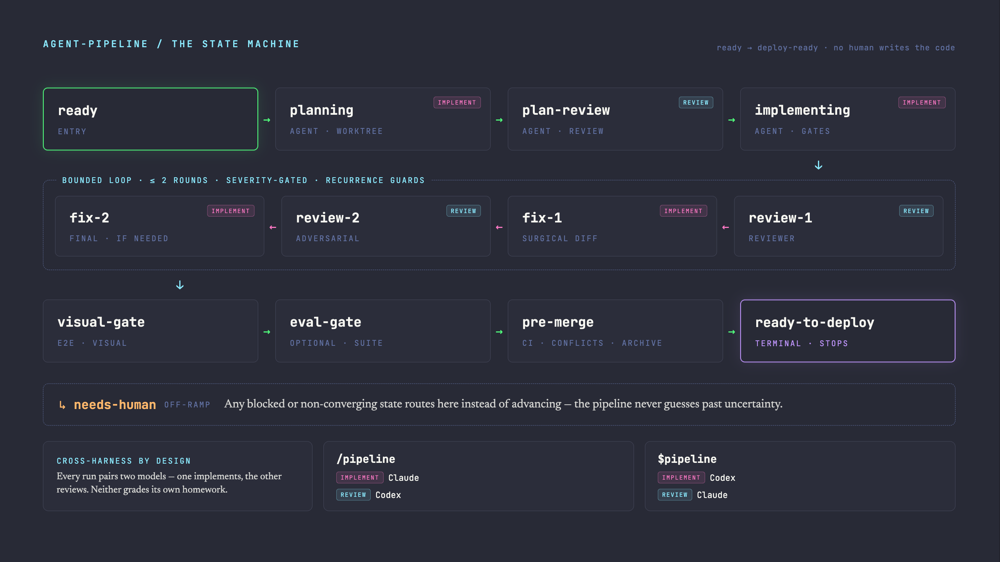

# agent-pipeline

**agent-pipeline** is a label-driven GitHub issue pipeline that advances an issue from backlog to `pipeline:ready-to-deploy` through a 15-stage state machine — planning → plan-review → implementing → design-gate → review → fix → pre-merge → visual-gate → eval-gate → shipcheck-gate. It does **not** auto-merge; you own the merge button.

It ships as a skill for **both Claude Code (`/pipeline`) and Codex (`$pipeline`)** from a single shared TypeScript core. **Both harnesses are required for every run**: one implements, and the other cross-reviews. By default, `/pipeline` uses Claude to implement and Codex to review; `$pipeline` inverts this. The pipeline is cross-harness by design — you cannot skip the reviewer install.

## Lifecycle



`ready` is the queue/opt-in entry point. Once a run starts, long-running work is labelled and recorded under the concrete stages that are doing it: `planning`, `plan-review`, and `implementing`. Recoverable stops keep the active `pipeline:*` stage plus `blocked`; exhausted or ambiguous paths park at `needs-human`. The pipeline never guesses past uncertainty and never presses merge.

| Band | What happens |
| --- | --- |
| Spec before code | `planning` writes the implementation plan/spec, and `plan-review` is the human sign-off before implementation starts. OpenSpec-backed repos reconcile and archive specs during `pre-merge`. |
| Structured review | Reviewers emit findings with severity, confidence, and file/line context. The same review input should lead to the same advance/block decision, not a model coin flip. |
| Bounded convergence | Review/fix rounds are capped by policy and guarded against recurring findings. If the run cannot converge cleanly, it stops with evidence instead of looping indefinitely. |
| Surgical fixes | `fix-1` and `fix-2` are scoped to reviewer findings. No opportunistic refactors, no scope creep, no destructive cleanup. |
| Gated stop | `pre-merge` checks CI, conflicts, mergeability, and spec archive. `visual-gate` can run a repo-defined E2E/visual suite (e.g. Playwright) and captures its artifacts as PR-visible evidence. `eval-gate` can run a repo-defined eval/scoring suite. `shipcheck-gate` lets the reviewer apply an acceptance rubric. |
| Human merge | `ready-to-deploy` is terminal for the autonomous loop. A human owns the merge button. |

| Naive AI loop | agent-pipeline lifecycle |
| --- | --- |
| `prompt -> code -> merge` | `plan -> build -> review/fix -> gated stop` |
| Unreviewed, unbounded, opaque | Reviewed, bounded, audited, human-gated |

## Contents

- [Lifecycle](#lifecycle)
- [Prerequisites](#prerequisites)
- [Quickstart](#quickstart)
- [Install](#install)
- [Usage](#usage)
- [Onboarding a new repo](#onboarding-a-new-repo)
- [Per-repo config](#per-repo-config-optional)
- [Test/build gate](#testbuild-gate-optional-default-on)
- [Troubleshooting](#troubleshooting)
  - [Evidence bundle](#evidence-bundle)
  - [External event sink](#external-event-sink-optional)
  - [Machine-readable artifact conventions](#machine-readable-artifact-conventions)
- [Advanced topics](#advanced-topics)
  - [Configurable steps](#configurable-steps)
  - [Human plan feedback](#human-plan-feedback)
  - [Commit traceability trailers](#commit-traceability-trailers-always-on)
  - [Visual gate](#visual-gate)
  - [Eval gate](#eval-gate)
  - [Shipcheck gate](#shipcheck-gate)
  - [OpenSpec integration](#openspec-integration)
  - [last30days context](#last30days-context)
  - [Conventions & carry-forward lessons](#conventions--carry-forward-lessons)
- [How the two hosts share one core](#how-the-two-hosts-share-one-core)
- [Repository layout](#repository-layout)
- [Editor / Desktop integration](#editor--desktop-integration)
- [Uninstall](#uninstall)
- [Development](#development)
- [License](#license)

## Prerequisites

The pipeline is **cross-harness** — each run uses one CLI to implement and the *other* to review. **Both CLIs are required regardless of which host you install.**

- **Node ≥ 24** with **`npm`** (npm ships with Node and installs the core's dependencies — commander, js-yaml, zod). The core runs TypeScript directly via native type-stripping; no build step.
- **`git`** and **`gh`** on PATH, with `gh auth status` authenticated against the target repo.
- **Both `claude` and `codex` CLIs** on PATH and **authenticated** — each run uses one to implement and the other to review.
- **Review runs on the *other* harness, invoked directly** (`reviewMode: prompt-harness`): the reviewer CLI is called with the pipeline's own JSON-returning review prompt. **No review plugin is required** — you just need the other harness's CLI installed and authenticated.
- **Same-harness fallback (if the reviewer CLI is missing).** Cross-harness review is the design and the recommended setup — keep both CLIs installed. But if the configured reviewer CLI is *not installed / not spawnable* at review time, the pipeline does not stall: the implementing harness reviews its own work instead, and every such review (plan-review and both rounds) is **prominently labeled as a same-harness self-review** in the posted comment and the stage transition. A self-review is weaker than an independent one, so the label makes clear it was not cross-harness; a self-reviewed item still advances normally (the pipeline never merges — a human owns that). If *neither* harness is spawnable, the item blocks with a specific reason (there is nothing to review with). A reviewer that runs but times out or errors is a genuine failure and still blocks — only a missing CLI triggers the fallback.
- `~/.agent-operating-contract.md` and a per-repo conventions file: `CLAUDE.md` (Claude) or `AGENTS.md` (Codex).
- **Optional:** the [OpenSpec](https://openspec.dev/) CLI (`npm i -g @fission-ai/openspec`) — only needed for repos that opt into the OpenSpec planning flow.
- No API keys — LLM budget comes from your `claude` / `codex` subscriptions.

The installer prints a prerequisite checklist during install (warnings do not block the install).

## Quickstart

**Step 1 — Install**

```bash
# Pinned to a released version (reproducible — recommended):
npx -y github:accidental-hedge-fund/agent-pipeline#v1.2.1 install

# Or track the latest default branch:
npx github:accidental-hedge-fund/agent-pipeline install
```

This detects which of `~/.claude` and `~/.codex` exist and installs to each. After installing for Codex, **restart Codex** to pick up the skill. Pin to a tag (`#v1.2.1`) for a reproducible install; the bare form tracks the latest default branch — see [Install a specific version](#install-a-specific-version).

**Step 2 — Label an issue and run**

```bash
# Create the pipeline:ready label if it doesn't exist yet
gh label create "pipeline:ready" --color 0075ca --description "Start the pipeline" 2>/dev/null || true

# Label any open issue to opt it in
gh issue edit N --add-label "pipeline:ready"
```

Then invoke from Claude Code:

```text
/pipeline N
```

Or from Codex (after restarting it):

```text
$pipeline N
```

The pipeline advances the issue up to 12 transitions per invocation — creating a worktree, opening a PR, requesting cross-harness review, fixing review findings, and running pre-merge checks — all without further manual input.

## Install

> Public repo under the `accidental-hedge-fund` org — no special access needed.

### Recommended: one command, both hosts

```bash
# Detects ~/.claude and ~/.codex; installs to each present host
npx github:accidental-hedge-fund/agent-pipeline install

# Or a specific host:
npx github:accidental-hedge-fund/agent-pipeline install --host claude
npx github:accidental-hedge-fund/agent-pipeline install --host codex
```

For a reproducible, non-interactive install — pin the released tag (`#v1.2.1`) and auto-accept the optional-dependency prompts with `--yes-deps`:

```bash
npx -y github:accidental-hedge-fund/agent-pipeline#v1.2.1 install --host claude --yes-deps
```

The bare commands above always track the **latest** default branch; add `#<tag>` to pin a release (see [Install a specific version](#install-a-specific-version)). The pipeline is **cross-harness** regardless of which host you install — `--host claude` only controls where the skill lands; the *other* harness's CLI (`codex`) is still required for review.

Or clone and run directly:

```bash
gh repo clone accidental-hedge-fund/agent-pipeline
node agent-pipeline/scripts/install.mjs install        # --host claude|codex|all  (default: all)
```

The installer copies the shared core and the right host overlay into `~/.claude/skills/pipeline` and/or `~/.codex/skills/pipeline`, writes a launcher shim, and pre-installs the core's dependencies. It honors `CLAUDE_CONFIG_DIR` and `CODEX_HOME`. **Restart Codex** after a Codex install; Claude picks the skill up live.

After the core install, the installer detects which optional feature tools (the OpenSpec CLI, the last30days skill) are relevant to your setup and prompts you to install or update each one. Declining any dependency still completes the core install.

To skip all prompts and auto-accept in non-interactive environments:

```bash
npx github:accidental-hedge-fund/agent-pipeline install --yes-deps
PIPELINE_INSTALL_DEPS=1 npx github:accidental-hedge-fund/agent-pipeline install  # same via env var
```

In non-interactive environments without `--yes-deps`, dependency prompts are skipped automatically and a summary is printed with instructions to re-run with `--yes-deps`.

#### Claude as the primary harness (`/pipeline`)

Claude Code implements, Codex reviews.

```bash
npx github:accidental-hedge-fund/agent-pipeline install --host claude
codex login                                            # the reviewer — review invokes `codex` directly
```

Review (`reviewMode: prompt-harness`) invokes the `codex` CLI directly with a JSON-returning prompt — **no review plugin needed**, just the authenticated `codex` CLI.

#### Codex as the primary harness (`$pipeline`)

Codex implements, Claude Code reviews.

```bash
npx github:accidental-hedge-fund/agent-pipeline install --host codex
claude auth login                                      # the reviewer — review invokes `claude` directly
```

Review (`reviewMode: prompt-harness`) invokes the `claude` CLI directly with a JSON-returning prompt — **no review plugin needed**, just the authenticated `claude` CLI. Then restart Codex and run `$pipeline N`.

### Claude Code plugin marketplace (versioned, auto-updatable)

```text
/plugin marketplace add accidental-hedge-fund/agent-pipeline
/plugin install pipeline@ahf-tools
```

This installs the same skill as a plugin (`/pipeline`, shown as `pipeline:pipeline`). If you have a personal install at `~/.claude/skills/pipeline`, the installer detects it automatically and offers to relocate it to a timestamped backup — no data is lost. Update later with `/plugin marketplace update ahf-tools`.

### Install a specific version

The bare `npx github:…` commands above install the **latest** code (the default branch). To install a specific released version instead, pin the git ref with `#<tag>` — released versions are tagged `vMAJOR.MINOR.PATCH` (see the [tags](https://github.com/accidental-hedge-fund/agent-pipeline/tags)):

```bash
# Install exactly v1.2.1 (any host flag works the same way)
npx -y github:accidental-hedge-fund/agent-pipeline#v1.2.1 install --host claude
```

Everything else is identical to the latest-version commands — `#v1.2.1` just tells `npx` to fetch that tag rather than the default branch. Or clone and check out the tag directly:

```bash
gh repo clone accidental-hedge-fund/agent-pipeline
cd agent-pipeline && git checkout v1.2.1
node scripts/install.mjs install --host claude
```

Confirm what's installed at any time with `pipeline --version` (or `/pipeline --version` / `$pipeline --version`).

> The plugin marketplace path above always tracks the **latest** published version and is not a way to pin an older release — use the `#<tag>` form for that.

### Updating an npx/clone install

For the `npx github:…` or clone-and-run install paths (not the plugin marketplace, which updates via `/plugin marketplace update`), refresh an existing install in place with the `update` verb — an idempotent alias for `install` that re-stages and atomically swaps the skill directory:

```bash
npx github:accidental-hedge-fund/agent-pipeline update            # both hosts
npx github:accidental-hedge-fund/agent-pipeline update --host claude
# or from a clone:
node scripts/install.mjs update --host claude
```

Running it twice in a row is a net no-op — safe to re-run whenever `pipeline doctor` reports the `install:version-freshness` check is behind the latest release (see [Preflight (doctor)](#preflight-doctor)).

## Usage

Each operation is available as its own discoverable `/pipeline:<command>` (Claude Code)
or `$pipeline:<command>` (Codex) entry. The advance loop has no sub-command.

```text
/pipeline N            $pipeline N            advance loop (default; up to 12 transitions)
/pipeline N --once                            advance one stage and stop
/pipeline N --dry-run                         log only; no harness calls, no GitHub writes
/pipeline N --detach                          run the advance loop in a detached background process

/pipeline:status N     $pipeline:status N     read-only: stage, blocker, PR, last review
/pipeline:status N --json                     machine-readable JSON status envelope (stable contract)
/pipeline:unblock N "<answer>"                post answer + clear the blocked label
/pipeline:override N "<key>: <reason>"        disposition a review finding and auto-resume the advance loop
/pipeline:summary N    $pipeline:summary N    print the run's evidence bundle for issue N (local, offline)
/pipeline summary <run-id>                    print the evidence bundle for an exact run (domain-independent)
/pipeline N --remove-worktree               remove issue N's on-disk worktree + local branch (bypasses kill switch)
/pipeline N --remove-worktree --force       same, discarding uncommitted changes with a warning
/pipeline N --remove-worktree --json        machine-readable JSON result (stable contract)
/pipeline:init         $pipeline:init         onboard: ensure labels + scaffold .github/pipeline.yml
/pipeline:cleanup      $pipeline:cleanup      sweep merged-PR worktrees
/pipeline config sync [--apply]             preview/apply a safe .github/pipeline.yml scaffold refresh
/pipeline config repo-map <add|remove|list> add/remove/list repo_map entries in .github/pipeline.yml
/pipeline:doctor       $pipeline:doctor       deterministic preflight check; print pass/fail summary, exit
/pipeline doctor --json                       machine-readable JSON doctor envelope (stable contract)
/pipeline doctor --is-ok                      silent exit-0/1 polling gate; no output
/pipeline N --doctor   $pipeline N --doctor   run the preflight before advancing; abort the run on any failure
/pipeline:intake --description "<text>"       spec a rough idea into a GitHub issue + propose a ROADMAP.md PR
/pipeline:intake "<text>" --release v1.6.0    same, pinning the target release slot
/pipeline:intake --description "<text>" --dry-run   print the proposed issue + roadmap diff without writing anything
/pipeline refine-spec --title "<t>" --body "<b>"  refine an existing issue's spec preview; non-mutating JSON output
/pipeline refine-spec --help                  probe for contract availability; exits 0 on supported installs
/pipeline:triage N --stage ready              set pipeline:ready on issue N; remove any other pipeline:* stage label
/pipeline:triage N --stage backlog            set pipeline:backlog on issue N; idempotent, no model call
/pipeline:sweep                               batch re-spec thin issues + reconcile ROADMAP.md (dry-run)
/pipeline:sweep --apply                       same, updating issue bodies and opening a ROADMAP reconciliation PR
/pipeline:sweep --apply --repo other/repo     sweep a different repository
/pipeline:roadmap                             analyze the open backlog → dependency-aware scored roadmap (dry-run)
/pipeline:roadmap --apply                     same, applying hygiene write-backs and opening a roadmap.md PR
/pipeline:roadmap --next <N>                  read existing plan.json, emit top-N dependency-safe issues (no re-run)
/pipeline:merge <pr>                          human-invoked squash-merge of a ready-to-deploy PR (no advance loop)
/pipeline:release <version>                   prepare a release PR for the given version
/pipeline:logs [<run-id>] [-f]               list or stream pipeline run logs
/pipeline improve                             read run artifacts; print dry-run cluster report (read-only)
/pipeline improve --apply                     same, then create GitHub issues for top-N recurring patterns
/pipeline improve --top 10 --since 2026-06-01 --json  limit scope + emit JSON array of clusters
/pipeline scoreboard                          read run artifacts; print factory throughput/cost/reliability metrics
/pipeline scoreboard --days 14 --json         emit one JSON scoreboard object for the last 14 days
/pipeline scoreboard --estimate-cost codex=0.75 --estimate-cost claude=1.00
/pipeline queue                               batch factory: dispatch all pipeline:ready issues up to limits
/pipeline queue --max-issues 5 --concurrency 2 --budget-dollars 2.00
/pipeline queue --label team:backend --milestone v2.0 --risk medium
/pipeline --version    $pipeline --version    print the package version, then exit (no number; -V alias)
```

**Deprecated flag forms** (still work, emit a one-line deprecation notice to stderr):
```
/pipeline N --status      → /pipeline:status N
/pipeline N --summary     → /pipeline:summary N
/pipeline N --unblock "…" → /pipeline:unblock N "…"
/pipeline N --override "…"→ /pipeline:override N "…"
/pipeline --init          → /pipeline:init
/pipeline --cleanup       → /pipeline:cleanup
```

The number is auto-detected as an issue or PR. PRs resolve to their linked closing issue; PRs with no `Closes #N` are refused. Items must carry a `pipeline:*` label (opt-in) — add `pipeline:ready` to start.

`/pipeline:cleanup` takes no number: it sweeps pipeline-managed worktrees under `worktree_root` whose PR is already merged, removing the worktree and its local branch. It only touches `pipeline/<N>-<slug>` worktrees, never the remote branch, and skips (reporting the reason) any worktree with uncommitted changes or a local HEAD that differs from the merged PR's commit. It is idempotent — a second run finds nothing to do.

## Intake sub-command

`pipeline intake` is a no-issue-number front-door command that turns a rough one-line description into a decision-complete GitHub issue **and** proposes a matching `ROADMAP.md` update — all in one shot.

```bash
# Generate a spec, create the issue, and open a ROADMAP PR:
/pipeline intake --description "add retry logic to the fix loop"

# Pin the target release slot:
/pipeline intake --description "add retry logic to the fix loop" --release v1.6.0

# Or pass the description as a positional argument:
/pipeline intake "add retry logic to the fix loop"

# Preview without writing anything to GitHub:
/pipeline intake --description "add retry logic to the fix loop" --dry-run
```

**What it does:**

1. **Spec generation (only model-invoking step):** invokes the claude harness with the description to produce a structured spec — Summary, User story, Acceptance criteria (testable `- [ ]` items), Out of scope, and Open questions only when genuinely ambiguous. Follows the same WHAT-not-HOW contract as the `/pm` skill. The raw output is passed through an extraction guard that strips any leading narration/tool-call text ahead of the spec; if the result still looks capture-shaped (narration/tool-call markers with no valid spec found), the harness is retried once before the issue is blocked.
2. **Issue creation (deterministic):** creates a GitHub issue with the generated spec body and two labels: `pipeline:ready` and `release:vX.Y.Z`.
3. **ROADMAP PR (deterministic):** writes three mutations to `ROADMAP.md` — a release-plan table row, a per-issue sem-ver table row, and a detail-section bullet — commits them on a new branch (`intake/issue-N-<slug>`), and opens a PR targeting the default branch for human review.

**Flags:**

| Flag | Description |
|------|-------------|
| `--description "<text>"` | Free-text seed description (required unless passed as positional arg). |
| `--release <vX.Y.Z>` | Pin the target release slot. When omitted, the first open lane in `ROADMAP.md` is proposed. |
| `--dry-run` | Print the proposed issue body and ROADMAP diff; exit without writing to GitHub or the filesystem. |

The pipeline never merges — the ROADMAP PR requires a human to review and merge the release-slot placement.

## refine-spec sub-command

`pipeline refine-spec` is a **non-mutating** spec-refinement preview command. It accepts an existing issue's title and body, invokes a single model harness call to refine the spec, and returns the result as a JSON object on stdout. It performs **no GitHub writes**, **no git writes**, and **no filesystem writes** — safe to call from any UI that needs a preview before the operator confirms a change.

```bash
# Refine an existing issue's spec and print JSON:
/pipeline refine-spec --title "Add retry logic" --body "## Summary\nA retry mechanism."

# --json is accepted (behavior is identical — output is always JSON):
/pipeline refine-spec --title "Add retry logic" --body "## Summary\n..." --json

# Probe for contract availability before calling with real content:
pipeline refine-spec --help   # exits 0 on installs that support this contract
```

**Output shape:**

```json
{
  "title": "Add retry logic to the fix loop",
  "body": "## Summary\n...\n## User story\n...\n## Acceptance criteria\n- [ ] ...\n## Out of scope\n- ...",
  "milestone": null
}
```

The `body` field follows the WHAT-not-HOW section contract: **Summary**, **User story**, **Acceptance criteria** (testable `- [ ]` items), **Out of scope**, and **Open questions** only when the input is genuinely ambiguous.

**Flags:**

| Flag | Description |
|------|-------------|
| `--title "<text>"` | Existing issue title (required). |
| `--body "<markdown>"` | Existing issue body in GitHub-flavored markdown (required). |
| `--json` | Accepted for compatibility; output is always JSON regardless. |

**Discovery:** a caller (e.g. Pipeline Desk) can probe whether this contract is available by running `pipeline refine-spec --help` and checking that the output contains usage text mentioning both `--title` and `--body` in a refine-spec context. Checking for a zero exit code alone is not sufficient: older installs may print generic top-level help and exit 0 without refine-spec-specific flag descriptions. Only when the output mentions `--title` and `--body` alongside `refine-spec` can the caller determine the contract is present.

## Sweep sub-command

`pipeline sweep` is a no-issue-number batch maintenance pass that re-specs every thin issue in the backlog and reconciles `ROADMAP.md` in one shot. Without `--apply` it only **previews** what it would change — safe to run at any time.

```bash
# Preview: print which issues would be re-specced and the proposed ROADMAP diff (no writes):
/pipeline sweep

# Apply: update thin issue bodies and open a ROADMAP reconciliation PR:
/pipeline sweep --apply

# Target a different repository:
/pipeline sweep --apply --repo owner/other-repo
```

**What it does:**

1. **Classify (deterministic):** for each open issue, applies a structural heuristic to decide if it is *sufficient* (leave as-is) or *thin* (needs re-speccing). The heuristic checks body length ≥ 150 chars, presence of ≥ 2 required section headings, and that the body isn't a single sentence.
2. **Re-spec (model-invoking, one call per thin issue):** for each thin issue, invokes the claude harness to generate an implementable spec body following the WHAT-not-HOW contract (Summary, User story, Acceptance criteria, Out of scope; Open questions only when genuinely ambiguous). Author context is preserved, not discarded. The raw output is passed through an extraction guard that strips any leading narration/tool-call text ahead of the spec; if the result still looks capture-shaped (narration/tool-call markers with no valid spec found), the harness is retried once before the issue is recorded as blocked.
3. **Roadmap reconciliation (deterministic):** identifies open issues absent from any of the three ROADMAP structures (release-plan table, per-issue sem-ver table, detail sections) and adds them. Under `--apply`, the update is delivered as a branch + PR for human review — never committed directly to the default branch.

**Flags:**

| Flag | Description |
|------|-------------|
| `--apply` | Apply writes: update thin issue bodies and open the ROADMAP reconciliation PR. Default is dry-run (preview only). |
| `--repo <owner/repo>` | Override the target repository. Default: current repo from `gh` config. |

**Idempotency:** a second sweep run recognizes already-specced issues as sufficient and skips them — no model calls, no updates.

The pipeline never merges — the ROADMAP reconciliation PR requires a human to review and merge.

**Config overrides** (`.github/pipeline.yml`):
```yaml
sweep:
  min_body_length: 200        # minimum body chars (default: 150)
  required_sections:           # headings that must be present (without ##)
    - Summary
    - User story
    - Acceptance criteria
    - Out of scope
```

## Backfill sub-command

`pipeline backfill` is a safe maintenance flow for adding OpenSpec coverage to repositories whose accepted behavior predates OpenSpec adoption. It previews which legacy behaviors are already covered, which are missing, which conflict with existing specs, and which are too uncertain to codify without human judgment. Without `--apply` it is fully **non-mutating**.

```bash
# Preview: analyze the repo and print a four-group coverage report (no writes):
/pipeline backfill

# Apply: author an OpenSpec change for missing-coverage behaviors and open a spec-only PR:
/pipeline backfill --apply

# Scope the apply slice to a named capability:
/pipeline backfill --apply --capability auth

# Target a different repository:
/pipeline backfill --repo owner/other-repo
```

**What it does:**

1. **Reads living specs (deterministic):** scans `openspec/specs/` for existing requirements. A partially-populated workspace is NOT treated as complete — coverage is computed from living-spec content, never from `openspec/` presence alone.
2. **Behavior analysis (single model call):** invokes the claude harness once to enumerate candidate accepted behaviors from the evidence corpus (tests, docs, code, git history), draft each as a requirement with provenance, and grade evidence as `sufficient`, `conflicting`, or `uncertain`.
3. **Classifies into four groups (deterministic):**
   - **already-covered** — behavior maps to a living requirement; not proposed again.
   - **missing-coverage** — sufficient evidence, no existing requirement; eligible for backfill.
   - **conflicting-evidence** — contradicts a living requirement or evidence sources disagree; surfaced for human decision, NOT codified.
   - **uncertain-evidence** — evidence too weak to justify codifying; surfaced for human decision, NOT codified.
4. **Apply path (--apply only):** authors an OpenSpec change with additive `## ADDED Requirements` deltas for the `missing-coverage` slice, validates with `openspec validate`, creates a branch, and opens a spec-only PR targeting the default branch. Never commits directly to the default branch; never merges.

**Flags:**

| Flag | Description |
|------|-------------|
| `--apply` | Apply: author a spec-only PR for the missing-coverage slice. Default is preview-only (no writes). |
| `--capability <name>` | Scope the apply slice to behaviors whose description contains `<name>`. |
| `--repo <owner/repo>` | Override the target repository. Default: current repo from config. |

**Non-mutating preview guarantee:** without `--apply`, the handler makes no write to the filesystem, no GitHub issue create/edit, no branch creation, and no PR creation. The output explicitly states "No specs, issues, branches, or PRs were changed."

**Spec-only guarantee:** the apply path asserts the authored diff touches only paths under `openspec/` and aborts before opening any PR if a non-`openspec/` path would change.

**Idempotency:** re-running backfill after a slice has landed recognizes previously-accepted requirements as `already-covered` and behaviors already proposed in an open backfill PR as already-proposed. Neither is duplicated.

**Operator guidance:**

- *When to use backfill:* use it when adopting OpenSpec in a repo with years of existing behavior, or when a partial `openspec/` workspace covers only recent changes and you want future pipeline runs checked against the full product contract.
- *How to review provenance:* each candidate in the report includes a provenance reference (test name, doc section, code path, or commit). Verify the reference is real before approving the backfill PR — provenance is what distinguishes established behavior from an accidental implementation detail.
- *How partial adoption is handled:* backfill computes coverage from living-spec content, not from the presence of an `openspec/` directory. A repo with 3 living requirements and 20 legacy behaviors will still show 17 candidates.
- *Why low-confidence behavior is not auto-codified:* `conflicting-evidence` and `uncertain-evidence` candidates require human judgment. Codifying a behavior that contradicts a living requirement or lacks concrete evidence would introduce a spec that is immediately wrong. These groups are surfaced for manual review, not silently committed.

The pipeline never merges — the spec-backfill PR requires a human to review and merge.

## Roadmap sub-command

`pipeline roadmap` generates a dependency-aware scored roadmap from the open backlog and writes `plan.json` + `roadmap.md` to `.agent-pipeline/roadmap/<repo>/`. Without `--apply` it only previews.

**Performance note:** on a small backlog, total wall-clock is roughly proportional to `(inventory harness calls × per-call time) + (dep-verify calls × per-call time)`. `plan.json` includes a `run_stats` object after every run so you can identify the slow phase from logs or the output file alone.

**Config overrides** (`.github/pipeline.yml`):
```yaml
roadmap:
  include_labels: []             # include only issues with at least one of these labels
  exclude_labels: []             # exclude issues with any of these labels
  inventory_concurrency: 4       # max concurrent harness calls during inventory (default: 4)
  depgraph_concurrency: 4        # max concurrent harness calls during dep verification (default: 4)
  depgraph_verify_cap: 20        # max dep candidates to source-verify; excess go to open_questions (default: 20)
  release_model: semver          # semver (default) | continuous
  release_capacity:              # capacity policy for the semver release model (#347)
    effort_budget: 8             # per-milestone effort-points budget (XS=1 S=2 M=3 L=5 XL=8; default: 8)
    isolate_breaking: true       # give each breaking-change issue its own milestone (default: true)
```

**Semver release model — capacity-aware milestone grouping (#347):**

When `release_model` is `semver` (the default), generated milestones are determined by *release substance* rather than a fixed issue count:

| Signal | Effect |
|--------|--------|
| `breaking-change` / `semver:major` label, or `breaking change`/`migration` in text | Classified as **major** impact → bumps major version (`v{M+1}.0.0`), isolated into own milestone |
| `chore` / `bug` / `maintenance` / `refactor` / `docs` label, or `cleanup` tier | Classified as **patch** impact → bumps patch version (`v{M}.{N}.{P+1}`) |
| `feature` / `enhancement` / `semver:minor` label | Classified as **minor** impact → bumps minor version (`v{M}.{N+1}.0`) |
| No impact-bearing signal (sparse metadata) | Conservative default: **minor** + uncertainty recorded in `plan.json` |

Issues accumulate into a milestone until adding the next would exceed `effort_budget` (effort points: XS=1 S=2 M=3 L=5 XL=8). A breaking-change issue (when `isolate_breaking: true`) or an oversized issue (effort ≥ budget) is always placed alone. The `continuous` model is unaffected by these rules.

## Triage sub-command

`pipeline triage <N> --stage <stage>` sets a pre-pipeline stage label on an issue without manual `gh issue edit`. It is the authoritative command for promoting an issue from `pipeline:backlog` to `pipeline:ready` (or the reverse). No model harness call — fully deterministic.

```bash
# Promote issue 42 from backlog to ready:
/pipeline triage 42 --stage ready

# Move issue 42 back to backlog:
/pipeline triage 42 --stage backlog
```

**What it does:**

1. Validates that `--stage` is one of the two allowed pre-pipeline values (`ready`, `backlog`). Any other value — including mid-flight stage names owned by the advance state machine — is rejected with a clear error before any GitHub call is made.
2. Fetches the issue's current labels.
3. Adds the target label, then removes all other `pipeline:*` labels (add-before-remove, so a partial failure never strands the issue without a stage label).
4. Idempotent: when the issue already carries exactly the target label and no other `pipeline:*` label, logs "already set" and exits 0 without making any write API call.

**Flags:**

| Flag | Description |
|------|-------------|
| `--stage ready` | Set `pipeline:ready`; remove any other `pipeline:*` stage label. |
| `--stage backlog` | Set `pipeline:backlog`; remove any other `pipeline:*` stage label. |

Only `ready` and `backlog` are settable via `triage`. Mid-flight stages (`planning`, `review-1`, `review-2`, etc.) are owned by the `pipeline advance` state machine.

## Merge sub-command

`pipeline merge <pr>` is a **human-only** command that squash-merges a ready-to-deploy PR and deletes its head branch. It is never called by the autonomous advance loop — the loop stops at `pipeline:ready-to-deploy` and a human (or pipeline-desk on a human button click) decides when to merge.

```bash
/pipeline merge 42
$pipeline merge 42
```

**What it does:**

1. **Mergeability gate:** verifies the PR is `MERGEABLE` with a `CLEAN` merge state. Refuses with an actionable message when the PR has conflicts, is in a dirty state, or GitHub has not yet computed mergeability.
2. **Status-checks gate:** verifies all required status checks have completed with a success or neutral conclusion. Names any failing or still-pending checks in the refusal message.
3. **Issue-stage gate:** resolves the PR's linked closing issue and confirms it carries the label `pipeline:ready-to-deploy`. Refuses if the issue is at any other stage, or if no linked issue is found.
4. **Squash merge:** invokes `gh pr merge --squash --delete-branch`; prints a confirmation and exits 0 on success.

If any gate fails the command exits non-zero with a clear, actionable message identifying the specific blocker — no merge is attempted.

**Invariant:** no `auto_merge` config key exists and the autonomous `advance` loop never invokes this handler. A unit test asserts the loop-isolation guarantee.

## Improve sub-command

`pipeline improve` is a **read-only** batch analyzer that reads `.agent-pipeline/runs/**/events.jsonl` and `summary.json`, clusters recurring failure patterns (review findings, blockers, flaky gates, token waste) and agent-reported friction (papercuts), and prints a dry-run report. It never modifies pipeline labels, branches, PRs, worktrees, or repo files.

```bash
/pipeline improve                         # dry-run: print cluster report to stdout
/pipeline improve --json                  # emit a JSON array of cluster objects
/pipeline improve --since 2026-06-01      # restrict to runs from this date onward
/pipeline improve --top 10               # show top-10 clusters instead of the default 5
/pipeline improve --apply                 # create GitHub issues for clusters with ≥3 occurrences
/pipeline improve --apply --min-occurrences 5  # raise the issue-creation threshold
```

**Cluster categories:** `review-finding` (same normalized finding title across runs), `blocker` (same normalized blocker reason), `flaky-gate` (same stage with repeated `outcome: error`), `token-waste` (stages with anomalously high token count or duration, when data is available), and `papercut` (same normalized message across agent-logged `pipeline papercut` events, #419/#421). A `papercut` cluster is never merged with a `flaky-gate`/`token-waste` cluster even when both describe the same underlying problem — agent-reported and telemetry-inferred evidence always stay in separate clusters.

**Output:** the default human-readable report lists category, normalized signal, occurrence count, affected run IDs, an evidence excerpt, and a proposed issue title. `--json` emits a JSON array with the same fields. When `--apply --json` are combined, each cluster object also includes the `issueUrl` of the created issue (and `alreadyTracked: true` when it points at a pre-existing issue rather than one just created).

**`--apply` safety:** only `gh issue create` is ever called — no label mutations, no branch writes, no pipeline state changes. Requires gh authentication; fails fast with a clear error if not authenticated. Before creating anything, `--apply` looks up open issues titled `[pipeline-improve] ...` once per invocation and skips any cluster that already has an open issue — re-running `--apply` never files a duplicate.

**Auto-file (opt-in, #421):** set `papercuts.auto_file: true` (see "Per-repo config") to skip the manual `--apply` step entirely. When enabled, the engine reuses this same clustering/dedup logic to file `pipeline:backlog`-only issues for recurring papercut clusters at `run_complete` and at the end of every `pipeline queue` batch, subject to `auto_file_min_occurrences`, a per-window rate cap (`auto_file_max_per_window` within `auto_file_window_hours`), and the same open-issue dedup as `--apply`. Auto-filed issues carry an explicit agent-reported-provenance statement and sanitized evidence, receive no label besides `pipeline:backlog`, and are never queued or advanced. The auto-file path is best-effort: any failure is logged and swallowed and can never fail a run, a stage, or a batch.

## Scoreboard sub-command

`pipeline scoreboard` is a **read-only** factory-control report over `.agent-pipeline/runs/*/run.json`, `events.jsonl`, and `summary.json`. It summarizes ready-to-deploy autonomy, cost per ready PR, stage accounting by issue/stage/harness/model/outcome, prompt size, run and stage durations, harness calls, fix rounds, blocker kinds, `pipeline:needs-human`, same-harness fallback, and test/eval/shipcheck pass rates. It never reads `terminal.log` and never modifies GitHub labels/comments, worktrees, config, or run artifacts.

```bash
/pipeline scoreboard
/pipeline scoreboard --since 2026-06-01T00:00:00Z --until 2026-06-15T00:00:00Z
/pipeline scoreboard --days 7
/pipeline scoreboard --json
/pipeline scoreboard --estimate-cost codex=0.75 --estimate-cost claude=1.00
```

When no window flags are supplied, the window is the last 30 days ending at command start. `--since`, `--until`, and `--days` select the reporting window. `--json` emits exactly one unfenced JSON object with `schema_version`, `window`, `totals`, `metrics`, and `diagnostics`; the human report prints the same metric headings plus diagnostics when present.

Cost metrics use recorded `cost_usd` or `usage.cost_usd` values when present. For harness calls without actual cost, pass repeatable `--estimate-cost <harness>=<usd-per-call>` values. Actual cost wins over estimates. If a successful PR has a recorded harness call with neither actual nor estimated cost, `cost_per_ready_pr_usd.value` is `null` and diagnostics name the missing harness estimate instead of silently using zero. Stage accounting records also distinguish `actual`, `estimated`, and `unknown` costs; unknown-cost invocations are counted explicitly and are not treated as free. Harness accounting also records numeric prompt-size telemetry (`prompt_chars`, `prompt_estimated_tokens`) and never stores raw prompt text.

The `claude` and `codex` built-in harnesses report actual per-call cost/token telemetry from their own machine-readable output mode, so most of their calls classify as `cost_source: "actual"` without any `--estimate-cost` value — `codex` reports token counters but never a cost field, so its calls still need `--estimate-cost` (or stay `unknown`). Set `PIPELINE_HARNESS_TELEMETRY=off` to fall back to the pre-telemetry plain-text invocation if this mode ever misbehaves; every call then degrades to `estimated`/`unknown` exactly as before. The scoreboard reports cost-source **coverage** — the actual/estimated/unknown call counts and an `actual_coverage` ratio (`null` for an empty window) — in both the human report and `--json` output, so you can judge how much of a window's cost is measured vs. guessed.

Historical artifact problems are reported as diagnostics, not crashes: missing run stores, missing/corrupt `summary.json`, missing/corrupt `run.json`, missing `events.jsonl`, partial final event lines, missing start times, and ready runs without PR numbers all surface with stable reason codes and file paths.

## Queue sub-command (batch factory)

`pipeline queue` is the **batch factory operation mode**: it fetches every `pipeline:ready`-labelled issue from the repo's backlog, ranks them by pipeline stage priority (highest-score stages first; ties broken by issue number ascending for FIFO order within the same stage), applies optional filters, and dispatches up to `--max-issues` of them in concurrency-bounded parallel pipeline runs.

Queue selection and launch are serialized by a repo-local lock at
`.agent-pipeline/locks/queue.lock`. A second `pipeline queue` invocation in the
same repo exits before launching work while a live queue batch owns the lock;
stale locks from dead processes are cleared automatically.

```bash
# Default run: up to 10 issues, concurrency 1, no budget cap
/pipeline queue

# Run up to 5 issues, 2 at a time, stop when cumulative cost reaches $2.00
/pipeline queue --max-issues 5 --concurrency 2 --budget-dollars 2.00

# Only issues carrying team:backend AND belonging to the v2.0 milestone, risk ≤ medium
/pipeline queue --label team:backend --milestone v2.0 --risk medium

# Multiple --label flags require ALL labels present (intersection / AND):
/pipeline queue --label team:backend --label size:small
```

**Flags** (all have config-file equivalents under the `queue:` key):

| Flag | Default | Description |
|---|---|---|
| `--max-issues <N>` | `10` | Maximum issues to start in this batch |
| `--concurrency <C>` | `1` | Maximum simultaneous pipeline runs |
| `--budget-dollars <D>` | unlimited | Halt new launches when cumulative cost (USD) reaches this limit |
| `--max-failure-rate <R>` | `1.0` | Halt new launches when `failed/completed ≥ R` (checked only after ≥ 3 completions) |
| `--label <L>` | (none) | Filter to issues carrying this label (repeatable; all must be present) |
| `--milestone <M>` | (none) | Filter to issues in this milestone (exact title match) |
| `--risk <level>` | (none) | Filter to issues at or below this risk level (`low` \| `medium` \| `high`); excludes any issue carrying a `risk:*` label above the specified level |

**Gate semantics:**
- **Budget gate**: checked after each run completes; when cumulative cost ≥ `--budget-dollars`, no further runs are launched. In-flight runs complete normally.
- **Failure-rate gate**: only fires when ≥ 3 runs have completed and `failed_count / completed_count ≥ --max-failure-rate`. `ready-to-deploy` and `needs-human` both count as succeeded; everything else counts as failed.

**Per-run config defaults** (`.github/pipeline.yml`):

```yaml
queue:
  max_issues: 10          # CLI --max-issues overrides this
  budget_dollars: null    # null = unlimited; CLI --budget-dollars overrides
  concurrency: 1          # CLI --concurrency overrides
  max_failure_rate: 1.0   # CLI --max-failure-rate overrides
```

**Batch summary artifact** (machine-readable):

After every run, `queue` writes `.agent-pipeline/runs/batch-<batch_id>/batch-summary.json`:

```json
{
  "schema_version": "1",
  "batch_id": "2026-06-28T20-18-09-000Z",
  "started_at": "2026-06-28T20:18:09.000Z",
  "ended_at": "2026-06-28T21:04:31.000Z",
  "halt_reason": null,
  "excluded_count": 3,
  "issues": [
    { "number": 42, "title": "...", "final_state": "ready-to-deploy", "cost_usd": 0.31, "duration_ms": 1234 }
  ],
  "aggregate": {
    "total_issues": 5, "succeeded": 4, "failed": 1,
    "failure_rate": 0.2, "total_cost_usd": 1.55, "total_duration_ms": 6170
  },
  "limits": { "max_issues": 5, "budget_dollars": 2.0, "concurrency": 2, "max_failure_rate": 1.0 }
}
```

`halt_reason` is `null` when the batch ran to natural completion, `"budget_exhausted"` when the budget gate fired, or `"failure_rate_exceeded"` when the failure-rate gate fired. `excluded_count` is the number of eligible issues that were filtered out (by label/milestone/risk/cap) and not dispatched.

## Onboarding a new repo

Before running the pipeline for the first time on a fresh repo, run `init` to create all pipeline labels and scaffold a starter config in one step:

```bash
/pipeline --init    # Claude Code primary
$pipeline --init    # Codex primary
```

`init` does three things, idempotently:

1. **Creates all pipeline labels** (`pipeline:<stage>`, `blocked`, `harness:claude`, `harness:codex`) in the target repo via `gh label create`. Labels that already exist are left untouched.
2. **Writes `.github/pipeline.yml`** with all configurable keys at their default values. If the file already exists it is preserved and a notice is printed — `init` never clobbers an existing config.
3. **Ensures the engine-managed artifact block in `.gitignore`** — a sentinel-delimited block listing `.agent-pipeline/runs/`, `.agent-pipeline/roadmap/`, and `.agent-pipeline/history/` (see "Ignored artifact paths" below). If `.gitignore` is absent it is created; if present without the block, the block is appended and every pre-existing byte is preserved; if the block is present but stale, only the span between the sentinels is rewritten. Lines outside the sentinels are never touched.

Safe to re-run: a second `init` on the same repo finds all labels present, the config file already there, and the artifact block already current, and exits cleanly. A normal `/pipeline N` run still creates any missing labels as a side-effect even if you never ran `init` — `init` is additive, not a new precondition. For repos with an older existing config, run `pipeline config sync` to preview a current scaffold refresh, then `pipeline config sync --apply` to write it after validation. Re-running `init` after an engine upgrade also refreshes the `.gitignore` artifact block to cover any newly added artifact directory.

**Ignored artifact paths.** The engine writes three local-only directories under `.agent-pipeline/` that must never be committed: `.agent-pipeline/runs/` (per-run evidence bundles), `.agent-pipeline/roadmap/` (generated roadmap artifacts, delivered through a PR by `pipeline roadmap --apply`), and `.agent-pipeline/history/` (per-issue evidence history, `issue-<N>.jsonl`). `init` ensures all three are gitignored via the managed block described above; without it, the first `/pipeline N` run on a fresh repo leaves the protected branch dirty and fails `pipeline doctor`'s `worktree-clean` check.

After running `init`, commit `.github/pipeline.yml` (edit as needed), add `pipeline:ready` to an issue, and start the pipeline.

## Per-repo config (optional)

Commit `.github/pipeline.yml` to override defaults:

```yaml
base_branch: main
worktree_root: .worktrees
review_timeout: 1200
ci_timeout: 900
ci_mode: github                    # github (default): wait for GitHub Actions check-runs; local: rely on the current run's local test-gate result and skip the GitHub Actions wait (see "ci_mode: local" below)
intake_timeout: 600                # seconds for the intake spec-generation harness (fail-fast on a hung call)
sweep_timeout: 600                 # seconds for each sweep issue re-spec harness
models:                            # per-phase model alias. Each key also accepts "auto" (see "Auto model/effort routing").
  planning: sonnet                 # planning / implementing / fix → implementer harness (only the claude implementer honors these; codex ignores them)
  implementing: sonnet
  review: claude-fable-5           # review → reviewer harness (default) — honored by both the claude and codex reviewer (codex via `-m <model>`)
  fix: sonnet
  intake: sonnet                   # intake spec-generation (always the claude harness; set "haiku" for max speed)
  sweep: sonnet                    # sweep spec-generation (always the claude harness)
effort:                            # per-phase reasoning effort — codex via -c model_reasoning_effort, claude via --effort. Absent key: no flag (operator's global setting applies). Each key also accepts "auto".
  planning: medium                 # implementer harness — also sources plan-review's effort (classified separately, see below)
  implementing: low
  review: high                     # reviewer harness — resolved round-aware (review-1 vs. review-2)
  fix: low
  intake: low                      # always the claude harness
  sweep: low                       # always the claude harness
conventions_md_path: CLAUDE.md     # excerpt embedded in prompts
domain_name: my-service
domain_description: a payments service
openspec:
  enabled: auto                      # auto (default) | on | off — see "OpenSpec integration"
  bootstrap: false                   # if true, run `openspec init` on repos that lack openspec/
last30days:
  enabled: false                     # opt-in pre-planning brief — see "last30days context"
  timeout: 600                       # seconds
steps:                               # turn optional steps off for speed/preference (default: all on)
  plan_review: true                  # cross-harness review of the plan before coding
  standard_review: true              # review-1 (and its fix round)
  adversarial_review: true           # review-2 (and its fix round)
  docs: true                         # include the docs-update instruction in the implementing prompt
test_gate:                           # run the repo's own tests/build before opening a PR
  enabled: true                      # default: true; set false to disable entirely
  command: "pnpm test"               # optional explicit command; auto-detected when absent
  max_attempts: 3                    # fix-harness invocations before blocking
  timeout: 300                       # seconds per test/build run
design_gate:                         # risk-triggered design-interrogation gate, between implementing and review-1 (#436)
  enabled: false                    # default: false; disabled repos see no behavior change at all
  triggers: [storage, auth]          # subset of built-in risk classes to arm (default: all — concurrency, storage, auth, migration, infrastructure, public-api, architecture)
  extra_triggers:                    # merge additional path globs into a named class
    storage: ["**/*warehouse*.*"]
  max_rounds: 2                      # interrogation/response rounds before parking at needs-human
  block_threshold: medium            # challenges at/above this severity block; below advise only
  min_confidence: 0.6                # challenges below this confidence advise rather than block
  limits:
    max_decisions: 8                 # decisions retained per record
    max_field_chars: 4000            # characters per free-text field before truncation
    max_artifact_bytes: 65536        # persisted decision-record artifact byte ceiling
visual_gate:                         # run the repo's E2E/visual suite after pre-merge, before eval-gate
  enabled: false                     # default: false; set true to enable (one-time declaration per repo)
  command: "npx playwright test"     # shell command to run; supports pipes, env vars, &&, etc.
  mode: gate                         # gate (default): fail routes to a fix round, blocks once attempts are exhausted | advisory: record result and always advance
  timeout: 900                       # hard stage-level budget in seconds per visual run
  max_attempts: 2                    # total visual runs (1 = no retry/fix round); gate mode: fix rounds = max_attempts - 1
  artifacts_dir: .pipeline-visual     # worktree-relative dir the command writes screenshots/diffs/traces into
eval_gate:                           # run the repo's eval harness after pre-merge, before ready-to-deploy
  enabled: false                     # default: false; set true to enable (one-time declaration per repo)
  command: "pnpm evals"              # shell command to run; supports pipes, env vars, &&, etc.
  mode: gate                         # gate (default): fail routes to a fix round, blocks once attempts are exhausted | advisory: record result and always advance
  timeout: 300                       # hard stage-level budget in seconds per eval run
  max_attempts: 2                    # total eval runs (1 = no retry/fix round); gate mode: fix rounds = max_attempts - 1
shipcheck_gate:                      # reviewer-owned acceptance rubric after eval-gate, before ready-to-deploy (#148)
  enabled: false                     # default: false; set true to enable
  mode: advisory                     # advisory (default): record without blocking | gate: block on fail verdict
  max_rounds: 1                      # reviewer invocations before surfacing parse-failure (default: 1)
  rubric_path: .github/shipcheck-rubric.md   # repo-root-relative path to the private rubric file
  block_on_partial: false            # gate mode only: when true, a "partial" verdict also blocks (default: false)
format_gate:                         # run formatter/linter commands after each implementing/fix harness (#182)
  - command: cargo fmt               # shell command to run in the worktree root
    auto_fix: true                   # true: commit any changes and re-run; false: block on non-zero exit
  - command: cargo clippy -D warnings
    auto_fix: false
review_policy:                       # which review findings block progression vs. merely advise
  block_threshold: medium            # critical|high|medium|low — findings below this advise, not block (default: medium; 'high' = more throughput, 'low' = block on everything)
  min_confidence: 0.7                # 0..1 — findings below this confidence advise, not block (default: 0.7)
  max_adversarial_rounds: 3          # cap review-round re-runs; after this, still-blocking findings go advisory and the item routes to pipeline:needs-human
doctor:                              # deterministic preflight capability check — see "Preflight (doctor)"
  runOnStart: false                  # default: false; if true, run the preflight before planning and abort the run on any failure
  failFast: false                    # default: false; if true, stop at the first failing check instead of collecting all failures
papercuts:                           # agent-logged minor-friction capture — see "Improve sub-command"
  enabled: false                     # default: false; if true, gate the papercut instruction into prompts (`pipeline papercut`)
  auto_file: false                   # default: false; if true, auto-file pipeline:backlog issues for recurring papercut clusters at run_complete and queue-batch end
  auto_file_window_hours: 24         # default: 24 — trailing window over which papercuts are clustered for auto-filing
  auto_file_max_per_window: 3        # default: 3 — max issues auto-filed within the window
  auto_file_min_occurrences: 3       # default: 3 (must be ≥2) — min in-window occurrences a cluster must meet to be auto-filed
review_harness: my-reviewer          # optional: override the reviewer CLI for the review step — see "Custom reviewer harness" (default: the profile's reviewer)
# The implementer harness is owned by the install profile and cannot be set here.
# Only the reviewer is overridable, via `review_harness`; a `harnesses:` key is
# rejected at config-parse time. `review_harness` also accepts a structured form
# for independent reviewer model/effort control — see "Custom reviewer harness".
harness_sandbox: false               # opt-in: true → claude implementer uses --permission-mode default instead of bypassPermissions (see "Sandboxed harness execution")
event_sink:                          # optional: deliver run events.jsonl records to an operator-controlled forwarder — see "External event sink"
  command: "logger -t pipeline"      # forwarder command; receives each event's JSON line on stdin. Unset -> no sink (local events.jsonl only, unchanged)
  mode: additive                     # additive (default): write events.jsonl AND deliver to the sink | exclusive: sink only
executors:                           # optional: named external executor definitions — see "External stage executors"
  opencode-main:
    type: agent-system                # full execution backend — valid for ANY model-invoking stage
    provider: opencode
    endpoint: https://opencode.internal/api
    credential: OPENCODE_API_KEY       # env-var NAME, resolved at invocation time — never the literal value
  local-ollama:
    type: model-endpoint              # raw OpenAI-compatible endpoint — valid ONLY for plan-review/review-1/review-2
    base_url: http://localhost:11434/v1
    model: llama3.1:70b
stage_executors:                     # optional: assign an executors: name to a model-invoking stage
  planning: opencode-main
  review-1: local-ollama
  review-2: local-ollama
```

### Custom reviewer harness (`review_harness`)

By default the review step runs on the profile's cross-harness reviewer (`codex` under `/pipeline`, `claude` under `$pipeline`). Set `review_harness` to point review at a different reviewer CLI instead — the implementer harness is unaffected and stays profile-owned:

```yaml
review_harness: my-reviewer          # any CLI on your PATH
```

When set, every review round (plan-review, review-1, review-2) invokes `my-reviewer` in place of the profile reviewer. By default the pipeline calls it as `my-reviewer "<prompt>"` — the JSON-returning verdict prompt is passed as a single positional argument — and reads the CLI's **stdout** as the review output. A custom reviewer must therefore:

- **Read the prompt from its first positional argument** (or from stdin — see `prompt_delivery` below) and run the requested review.
- **Print a fenced JSON verdict block on stdout** matching the schema the pipeline gates on — `{"verdict": "approve" | "needs-attention", "summary": …, "findings": […], "next_steps": […]}` (the same `{{schema_block}}` a built-in reviewer returns; see `core/scripts/review-schema.ts`). Findings drive the severity policy exactly as with a built-in reviewer.
- **Be an installed/authenticated CLI** — no API key is introduced; like `claude`/`codex`, the reviewer brings its own auth.

If the configured CLI is **not installed or not executable**, the review step fails with a specific, named reason (`reviewer CLI 'my-reviewer' not found or not executable — ensure it is installed and on PATH`) and the [same-harness fallback](#prerequisites) applies — the implementing harness reviews instead, prominently labeled. When `review_harness` is absent, the profile's reviewer is used unchanged.

`review_harness` also accepts a structured form to control the reviewer's model, reasoning effort, and prompt-delivery channel independently of `models.review`/`effort.review`:

```yaml
review_harness:
  command: claude
  model: auto           # or an explicit alias, e.g. claude-fable-5
  effort: auto           # or an explicit level, e.g. high
  prompt_delivery: stdin # optional: "argv" (default) or "stdin"
```

`model`/`effort` here take precedence over `models.review`/`effort.review` when set. `"auto"` resolves round-aware: plan-review and review-2 are classified Adversarial/Definitive (`max`), review-1 is Adversarial/Iterative (`high`) — see "Auto model/effort routing" below. The bare string shorthand (`review_harness: my-reviewer`) is unchanged and leaves the reviewer's model/effort/prompt-delivery sourced from `models.review`/`effort.review`/the `argv` default.

**`prompt_delivery`** (default `argv`): a review prompt built from a large diff can exceed Linux's `MAX_ARG_STRLEN` (131,072 bytes) — the maximum size of a single command-line argument. On the default `argv` delivery, a prompt over that size is refused **before spawning** with a named error stating the limit, the measured prompt size, and this setting as the remedy — never a bare, transient-looking spawn failure. If your custom reviewer CLI reads its prompt from standard input, set `prompt_delivery: stdin` to sidestep the limit entirely: the CLI is spawned with no prompt positional and the full prompt is written to its stdin instead, regardless of size.

### Auto model/effort routing (`auto`)

Every `models.*` and `effort.*` key (including the structured `review_harness.model`/`effort`) accepts the sentinel `"auto"` instead of an explicit value. `auto` is resolved at config-load time from a fixed routing table keyed on each stage's task nature and output permanence — no stage ever sees the literal string `"auto"`.

| nature \ permanence | Ephemeral | Iterative | Definitive |
|---|---|---|---|
| **Mechanical** (implementing, fix) | gpt-5.5 / low | gpt-5.5 / low | sonnet / medium |
| **Analytical** (planning, intake, sweep) | sonnet / low | opus / medium | claude-fable-5 / high |
| **Adversarial** (plan-review, review-1, review-2) | claude-fable-5 / medium | claude-fable-5 / high | claude-fable-5 / max |

A Mechanical stage's model forks by harness (`gpt-5.5` under the codex primary harness, `sonnet` under claude — `gpt-5.5` is codex-only) — every other cell resolves the same model regardless of harness, so an inert (harness-mismatched) `auto` result is reported exactly like an inert explicit alias (see "inert models.\* alias warning"). Adversarial stages always resolve `claude-fable-5` (the full model id — never the unrecognized short alias `fable-5`) regardless of `--profile`, so alternative-harness routing is profile-independent.

### External stage executors (`executors:` / `stage_executors:`)

`review_harness` only overrides the *reviewer* CLI. `executors:` + `stage_executors:` generalize that to **every** model-invoking stage (`planning`, `implementing`, `review-1`, `review-2`, `fix-1`, `fix-2`, `plan-review`, `shipcheck-gate` when enabled), and to two kinds of external delegate, not just a local CLI. Both keys are opt-in — a repo with neither behaves exactly as today.

```yaml
executors:
  opencode-main:
    type: agent-system              # full execution backend (OpenCode / HermesAgent / OpenClaw / …)
    provider: opencode               # a plain provider identifier — the pipeline does not ship per-provider adapters
    endpoint: https://opencode.internal/api
    credential: OPENCODE_API_KEY     # env-var NAME resolved from the environment at invocation time — never stored or emitted
  local-ollama:
    type: model-endpoint             # raw OpenAI-compatible /chat/completions endpoint (e.g. local Ollama)
    base_url: http://localhost:11434/v1
    model: llama3.1:70b
    # credential omitted — valid for a localhost endpoint with no auth

stage_executors:
  planning: opencode-main
  review-1: local-ollama
  review-2: local-ollama
```

- **`agent-system`** executors may be assigned to **any** model-invoking stage. The pipeline `POST`s `{ "stage": "<name>", "prompt": "<full prompt text>" }` to `endpoint` (adding `authorization: Bearer <resolved-credential>` when `credential` is set) and expects back `{ "output": "<text>" }`; `output` becomes that stage's harness stdout and flows through the exact same downstream contract (including `parseStructuredVerdict` + `review_policy` for review stages) as a local `claude`/`codex` invocation.
- **`model-endpoint`** executors are restricted to the **prompt-contained** stages `plan-review`, `review-1`, `review-2` — these are the only stages whose prompt already embeds everything needed (PR diff, plan text, conventions excerpt) inline. A raw model endpoint has no repository or tool access — it cannot check out the worktree, run tests, or commit — so it is structurally incapable of an execution-environment stage. Assigning a `model-endpoint` executor to `planning`, `implementing`, `fix-1`, `fix-2`, or `shipcheck-gate` is rejected **at config-parse time** — before any stage runs — with an error naming both the stage and the executor.
- Credentials are **references** (an environment-variable name), resolved from the process environment only at invocation time. The secret value is never written to `pipeline.yml` and never appears in run evidence or accounting output — only the reference name does (or nothing, for an unauthenticated local endpoint).
- A misconfigured, unreachable, or non-compliant executor is caught by a **preflight check before the stage runs** and blocks the item with an error naming the stage and provider. There is **no silent fallback** to the local `claude`/`codex` harness — this is a deliberate operator choice, distinct from (and takes priority over) the `review_harness` self-review fallback described above, which never applies to a `stage_executors` assignment.
- Run evidence records which executor (and provider, and — for `model-endpoint` — model name) ran each delegated stage.

#### `model-endpoint` request controls (OpenRouter and beyond)

A `model-endpoint` definition can declare its wire **`dialect`**, an allowlisted **`params`** block, controlled extra **`headers`**, a **`reasoning`** effort request, and a **`structured_output`** hint — all optional; a bare `base_url`/`model` definition still sends today's minimal `{model, messages}` request, byte-identical to before. Example targeting OpenRouter:

```yaml
executors:
  openrouter-review:
    type: model-endpoint
    base_url: https://openrouter.ai/api/v1
    model: openai/gpt-5
    credential: OPENROUTER_API_KEY        # env-var NAME, resolved at invocation time — never the literal value
    dialect: openrouter                   # openai (default) | openrouter | none — declared explicitly, never guessed from base_url or model
    params:
      temperature: 0
      seed: 7
      max_output_tokens: 4096
      provider:                           # OpenRouter-only routing preferences (rejected at parse time on any other dialect)
        order: [openai]
      models: [openai/gpt-5, anthropic/claude-fable-5]   # OpenRouter-only fallback list
    headers:
      x-title: agent-pipeline-review      # non-secret literal
      http-referer:
        env: OPENROUTER_REFERER           # resolved from the environment at invocation time only — never written to evidence
    reasoning:
      effort: high                        # encoded as OpenRouter's reasoning:{effort} field for this dialect
      # on_unsupported: record            # opt-in: run anyway with effort recorded "unsupported" instead of failing preflight
    structured_output: true               # adds this dialect's JSON-schema response_format — a transport hint only; parseStructuredVerdict + review_policy stay authoritative

stage_executors:
  review-2: openrouter-review
```

- **`dialect`** (`openai` default, `openrouter`, or `none`) is the sole source of truth for how reasoning effort and structured output are put on the wire, and for which response fields are read back as provenance — never inferred from `base_url` or `model`. `none` declares an endpoint that can express neither; requesting an effort against it fails preflight unless `reasoning.on_unsupported: record` is set, in which case the request is sent without the effort and the record marks it `unsupported` rather than silently dropping it.
- **`params`** is a strict allowlist (`temperature`, `top_p`, `seed`, `max_output_tokens`, `stop`, plus the OpenRouter-only `provider`/`models` routing options) — an unrecognized key, or a routing option on a non-`openrouter` dialect, is rejected at config-parse time naming the offending key.
- **`headers`** values are a non-secret literal string or `{ env: VAR_NAME }`; a `headers:` block can never declare `authorization` or `content-type` (rejected at parse time). A missing referenced env var fails preflight naming the stage, executor, header, and variable — the resolved value never reaches run evidence, only the header name and (for an `env:` entry) the reference name do.
- Run evidence records the exact resolved request (model, params, encoded reasoning control, header names) after redaction, plus response provenance where the endpoint exposes it — resolved model, upstream provider, request id, finish reason, token/cache usage, reported cost, retry/rate-limit signals, timing — `null` when the endpoint doesn't report a field, never guessed from the model string. A `model-endpoint` invocation's accounting record also carries an explicit `api-key` execution class, distinct from a local `claude`/`codex` harness invocation, so the two are never conflated in a comparison.
- An eval-runner cell (see `stage-eval-runner`) can bind an API treatment to a named `model-endpoint` executor via a `treatments.executor` axis, with `model`/`effort` supplied as a per-cell override computed in memory — the committed `executors:` definition is never rewritten, and an invalid override is classified as an infrastructure/config failure, never a completed treatment outcome.

### Local CI mode (`ci_mode: local`)

By default (`ci_mode: github`) the pre-merge gate polls `gh pr checks` and waits for GitHub Actions to pass before advancing. For repos where the local gate (`npm run ci`, `pnpm test`, etc.) is **identical** to what Actions runs, this is a redundant second run of the same command. Set `ci_mode: local` to skip the GitHub Actions wait and rely on the current pipeline run's local test-gate result instead:

```yaml
ci_mode: local   # default: github
```

**When `ci_mode: local`:**
- The pre-merge gate reads the current run's test-gate outcome from the run store instead of polling `gh pr checks`.
- If the test gate passed in this run, pre-merge advances to the mergeability and OpenSpec-validation steps (those still run in both modes).
- If the test gate failed, or if no test-gate result is recorded for this run (gate skipped, disabled, or log unreadable), the gate blocks with a clear message rather than silently skipping verification — it never advances with zero verification.

**Operator responsibility:** only enable `ci_mode: local` when:
- The local gate (`test_gate.command` or auto-detected) runs the same checks as GitHub Actions.
- Branch protection rules are set appropriately for your team — the pipeline stops at `pipeline:ready-to-deploy` regardless of `ci_mode`; a human still merges the PR.

For repos with matrix builds, environment-specific secrets, or CI steps that differ from the local command, stay on `ci_mode: github` (the default).

## Preflight (doctor)

`pipeline doctor` runs a fast, **deterministic, model-free** capability check and prints a per-check pass/fail/warn summary — a "this repo is runnable" signal before any autonomous work begins. It exits `0` when every check passes or only warns, and `1` when any check fails, so it drops cleanly into CI or an onboarding script. It invokes no language model and consumes no tokens.

```bash
/pipeline doctor    # Claude Code primary
$pipeline doctor    # Codex primary
```

The checks (each emits one sentence of remediation text on failure or warning):

| Check | Passes when | Skipped when |
| --- | --- | --- |
| `cli:gh` / `cli:node` | `gh` and `node` are on `PATH` | — |
| `github-auth` | `gh auth status` exits 0 | — |
| `repo-access` | `gh repo view <repo>` succeeds | — |
| `worktree-clean` | the checkout has no uncommitted changes **while on a protected branch** (`main`/`master`/`staging`/`base_branch`); feature branches always pass | — |
| `harness:<bin>` | each configured harness (`claude`/`codex`) is on `PATH` | — |
| `install:version-coherence` | the running engine version matches `core/package.json` at the install root | — |
| `install:version-freshness` | the installed engine version is `>=` the latest agent-pipeline release tag (**warns**, never fails, when behind — see below) | the latest release is unreachable (offline / `gh` failure / unparseable output) |
| `package-install` | `node_modules` exists and is not older than `package-lock.json` | the repo root has no `package-lock.json` |
| `openspec-cli` | the `openspec` CLI is on `PATH` | OpenSpec is not active (`openspec.enabled: off`, or `auto` with no `openspec/` dir) |
| `eval-command` | the configured eval command's binary resolves on `PATH` | the eval gate is off or has no `command` |

**Stale-install warning (#385).** `install:version-freshness` compares the installed engine against the latest `accidental-hedge-fund/agent-pipeline` GitHub release tag. A behind install reports `warn` — loud but **non-blocking**: it never fails the preflight, never sets a non-zero exit code, and never aborts a `--doctor` / `doctor.runOnStart` run. The remediation names the [update command](#updating-an-npxclone-install). The check only reports; it never updates anything itself.

**Run-start gating (opt-in).** Set `doctor.runOnStart: true` in `.github/pipeline.yml`, or pass `--doctor` on a normal run, to run the preflight **before planning**. A failing preflight prints the summary and aborts with a non-zero exit **before any planning, implementation, or review tokens are spent**. With neither set, a run is completely unaffected — no checks execute. `--fail-fast` (or `doctor.failFast: true`) stops at the first failing check instead of collecting all failures.

The latest result is stored under `/tmp/pipeline-<domain>-doctor-result.json`; `/pipeline N --status` appends that preflight summary (with its timestamp) when one is present, and omits the section otherwise.

**Machine-readable output (#154).** Two flags expose the doctor result as a stable JSON contract for tooling (e.g. Pipeline Desk):

- `pipeline doctor --json` — emits a single unfenced JSON object with `schema_version`, top-level `status` (`"ok"`, `"warnings"` when ≥1 check warns and none fail, or `"error"` when any check fails — a fail dominates a co-occurring warn), and a `checks` array where each entry is `{name, status, ok, reason, fix}` (`status` is `"pass"|"warn"|"fail"|"skip"`; `ok` is retained for backward compatibility and equals `status !== "fail"`). Exit code mirrors the prose path (0 = all pass/warn, 1 = any fail). Human output is suppressed.
- `pipeline doctor --is-ok` — runs all checks, emits **zero bytes of output**, and exits 0 (all pass) or 1 (any fail). Use for cheap polling. Mutually exclusive with `--json`.

Similarly, `pipeline N --status --json` emits a single unfenced JSON object describing the issue's pipeline state (`schema_version`, `status`, `issue`, `stage`, `pr`, `branch`, `worktree`, `last_event`, `review_summary`, `next_action`, `config`). The human `--status` output is unchanged when `--json` is absent.

## Worktree dependency install (`setup_command`)

When the pipeline creates a fresh worktree for an issue, it automatically runs the repo's dependency install step before any stage executes. This ensures binaries (e.g. `vitest`, `jest`, `tsc`) are available when the test/build gate runs.

**Auto-detection (default):** the pipeline checks the worktree root for a lockfile and runs the corresponding install command:

| Lockfile | Command |
| --- | --- |
| `pnpm-lock.yaml` | `pnpm install` |
| `yarn.lock` | `yarn install` |
| `package-lock.json` | `npm ci` |

When `node_modules` already exists in the worktree (e.g. on a subsequent run), the install step is skipped automatically (idempotent fast-path). When no lockfile is present and no `setup_command` is configured, the step is silently skipped.

**Override or opt out** with `setup_command` in `.github/pipeline.yml`:

```yaml
# Explicit install with flags:
setup_command: "pnpm install --frozen-lockfile"

# Multi-step setup (shell operators work — the command is run via /bin/sh -c):
setup_command: "pnpm install && pnpm run build:types"

# Opt out entirely (skip the install step even when a lockfile is present):
setup_command: ""
```

When `setup_command` is set to a non-empty string, it overrides auto-detection entirely — the configured command runs even when `node_modules` is already present. When set to `""`, the install step is skipped regardless of lockfile presence.

**Failure handling:** if the install command exits non-zero, the pipeline blocks immediately with a `worktree-setup-failed` blocker and surfaces the command output. Subsequent stages never run. The `blocked` comment tells you to fix the root cause (e.g. missing package manager, bad lockfile) or set `setup_command: ""` to opt out, then re-run.

## Sandboxed harness execution (`harness_sandbox`)

By default, the claude implementer runs with `--permission-mode bypassPermissions`, which grants unrestricted host access. Set `harness_sandbox: true` in `.github/pipeline.yml` to switch to claude's native sandboxed permission mode:

```yaml
harness_sandbox: true   # claude implementer uses --permission-mode default (sandboxed)
```

When `harness_sandbox` is `true`, the claude harness is invoked with `--permission-mode default` instead of `bypassPermissions`. All other flags are unchanged. The codex harness is already workspace-sandboxed via `--full-auto` and is unaffected by this setting in both modes.

On runners where Codex's bubblewrap/user-namespace sandbox cannot start because the host is already externally sandboxed, set this runner-local environment variable:

```bash
PIPELINE_CODEX_NO_SANDBOX=1
```

With that explicit operator opt-in, the codex harness uses Codex's automation no-sandbox mode (`codex exec --dangerously-bypass-approvals-and-sandbox`) instead of `--full-auto`. Use it only when the surrounding worker/supervisor already provides the required isolation.

**Default** (`harness_sandbox: false` or absent, and no `PIPELINE_CODEX_NO_SANDBOX=1`): the invocation is byte-identical to the pre-change behaviour — `--permission-mode bypassPermissions` for claude and `--full-auto` for codex. No change to existing repos unless you opt in.

## Test/build gate (optional, default on)

When `test_gate.enabled` (the default), the target repo's **own** test/build command runs inside the worktree during implementation and **after each fix round**, before a PR is opened or the item advances. If it fails, the implementer harness gets the failure output and retries in a **bounded generate→test→fix loop** — up to `max_attempts` fix invocations (default 3), each test run capped at `timeout` seconds (default 300). The item never opens a PR or advances while the command is failing; persistent failure → `blocked` with the captured output surfaced on the issue.

The command is **auto-detected** (first match wins):

1. Explicit `test_gate.command` override (run through `bash -c` with `set -o pipefail` so shell operators like `&&`, `||`, `;`, and `|` work — and a failing stage in a pipeline like `npm test | tee log` fails the gate instead of being masked)
2. `package.json` — a real `test` script (npm placeholder/`echo` stubs skipped), else a `build:check` / `typecheck` / `type-check` / `build` script; the package manager follows the lockfile (`pnpm-lock.yaml` → pnpm, `yarn.lock` → yarn, else npm)
3. `go.mod` → `go test ./...`
4. `Cargo.toml` → `cargo test`
5. pytest — only with a concrete marker (`pytest.ini`, root `conftest.py`, or a `[tool.pytest*]` section in `pyproject.toml`); `pyproject.toml` alone is **not** enough
6. `Makefile` with a `test:` target → `make test`

**Repos with no detectable command (and no override) are skipped entirely** — zero behavior change. For monorepos or custom runners, set `test_gate.command` explicitly. **Rollback** is a one-line `test_gate: { enabled: false }`.

### Matching CI: set `test_gate.command` when CI does more than `npm test`

Auto-detection picks the package `test` script (or equivalent). If your CI also runs additional steps — a generated-artifact sync check, a typecheck pass, an install smoke-test — the gate will miss those steps and a CI-only failure can escape to pre-merge.

**Fix:** add a script that chains all CI steps and point the gate at it:

```yaml
# .github/pipeline.yml
test_gate:
  command: "npm run ci"   # wraps the full CI command sequence (see package.json)
```

```json
{
  "scripts": {
    "ci:core": "(cd core && npm ci --no-audit --no-fund && npm test)",
    "ci:fast": "npm run ci:core && npm run build:check",
    "ci": "npm run ci:core && node scripts/build.mjs --check && npm run ci:install-smoke && npm run ci:launcher-smoke",
    "ci:install-smoke": "node scripts/ci-install-smoke.mjs",
    "ci:launcher-smoke": "node scripts/launcher-smoke.mjs"
  }
}
```

`test_gate.command` is run through `bash -c` with `set -o pipefail`, so compound operators like `&&`, `||`, `;`, and `|` work directly in the config value — and `pipefail` ensures a failing earlier stage in a pipeline (e.g. `npm test | tee log`) fails the gate rather than being hidden by the last stage's exit code. (Configured commands therefore require `bash`; it is assumed present, as on every supported CI runner and dev host.) Auto-detected commands (entries 2–6) continue to spawn the binary directly without a shell.

### Local verification: fast vs full gate

Two tiers, so you can verify the right amount before pushing and let CI run less duplicated work:

| Command | What it runs | When |
|---------|--------------|------|
| `npm run ci:fast` | core unit tests + `plugin/` mirror check | **default, per commit** — the quick local gate (~16s) |
| `npm run ci` | clean install + core tests + mirror check + install-smoke + launcher-smoke + `openspec validate --all` (if `openspec/` present) | **before opening a PR / cutting a release** — the exact gate GitHub Actions runs |
| `cd core && node --test --experimental-strip-types test/<file>.test.ts` | a single test file | **targeted** — iterating on one area |

`ci:fast` catches the vast majority of failures (logic regressions and a stale `plugin/` mirror) without the packaging install/launcher smoke-tests, which rarely break from a normal `core/` change and are reserved for the full gate. `ci` is the CI-equivalent: the GitHub Actions workflow runs this identical script, so a green `npm run ci` locally means a green CI run. Run `ci:fast` while iterating; run `ci` once before you push a PR.

The full `ci` gate also runs `openspec validate --all` when an `openspec/` directory is present at the repo root. A structurally invalid living spec or active change fails `npm run ci` and therefore blocks the PR in GitHub Actions. The step is a no-op when no `openspec/` directory exists, so non-OpenSpec repos and the install smoke test are unaffected.

After validation, the same step runs a default-branch active-change hygiene guard: on the default branch, any directory under `openspec/changes/` other than `archive/` is an unexpected active change and fails the step, naming the offending id(s) and the expected cleanup path (pre-merge archiving, or `openspec archive <id>`). The guard is inert on pull-request branches, where an in-flight change is expected. Mode resolves from `OPENSPEC_HYGIENE_MODE` (`default-branch` | `pr` | `off`), then the GitHub Actions environment, then the locally checked-out branch, and fails open (no-op) when it can't be determined. A checked-in `openspec/active-allowlist.txt` (one change id per line, `#` comments) is the only exemption — a missing or empty file means zero exemptions.

> CI runs the full gate on **every** commit (including the pipeline's OpenSpec-archive commits — the pre-merge gate depends on it) and cancels superseded runs automatically, so the cheapest way to save Actions minutes is to catch failures with `ci:fast` locally before pushing.

## Format/lint gate (optional, default off)

The single most common cause of pre-merge CI failures in multi-language repos is formatter/linter drift: the implementing or fix harness produces code that **compiles and passes review but is not style-clean** — `cargo fmt --check`, `cargo clippy -D warnings`, or `eslint` fail only at the CI step after the PR is opened. `format_gate` closes that gap by running configured commands **inside the worktree immediately after each implementing or fix-round harness exits**, before the PR is opened or updated.

Configure `format_gate` in `.github/pipeline.yml` as an array of entries, each with:

- **`command`** (`string`): shell command to run in the worktree root. Run through `/bin/sh -c`, so pipes, `&&`, and env vars are valid.
- **`auto_fix`** (`boolean`): when `true`, the command is expected to mutate files (e.g. `cargo fmt`, `eslint --fix`). The pipeline commits any changes it produces with message `chore: auto-format (#N)` and re-runs the command to verify stability. When `false`, the command is check-only (e.g. `cargo clippy -D warnings`) — a non-zero exit immediately blocks without any worktree mutation.

```yaml
format_gate:
  - command: cargo fmt           # auto-fix: runs, commits any changes, re-runs to confirm stable
    auto_fix: true
  - command: cargo clippy -D warnings   # check-only: blocks on non-zero exit
    auto_fix: false
```

For JS/TS repos:

```yaml
format_gate:
  - command: eslint --fix src/
    auto_fix: true
  - command: prettier --check src/
    auto_fix: false
```

**How it runs:**

1. After the implementing or fix-round harness exits and commit-range verification passes, each format gate entry runs in order.
2. `auto_fix: true` — the command runs. If uncommitted changes are present afterward, they are staged and committed as `chore: auto-format (#N)`. The command then re-runs; if the re-run exits non-zero, the pipeline blocks.
3. `auto_fix: false` — the command runs. If it exits non-zero, the pipeline blocks immediately with the command's combined output as the reason.
4. If the gate produces an auto-format commit, the review-SHA gate recognizes it as pipeline-internal and does **not** re-trigger a full review cycle.

**When no `format_gate` is configured** (the default), the step is a no-op and behavior is completely unchanged — existing pipeline runs are unaffected.

**Failure handling:** a blocked format gate posts a `## Pipeline: Blocked` comment on the issue with the failing command and its output. Fix the formatting/lint issue in the worktree, commit, clear the `blocked` label, and re-run.

## Build-artifact rebuild (optional, `build_command`)

Some repos commit **generated build artifacts** — a `dist/` directory, a plugin manifest, a generated mirror — and enforce their freshness in CI with a check the pipeline doesn't run locally (`git diff --exit-code -- dist`, `openclaw plugins build --check`, etc.). When a fix or auto-fix round edits source but doesn't rebuild those artifacts, the round commits stale generated files: the pipeline's own test/build gate passes (the freshness check is a separate CI step), the item advances to `ready-to-deploy`, and then loses a round-trip to a CI artifact-drift failure.

`build_command` closes that gap: declare a repo build command, and every **fix** and **auto-fix** (test-gate fix-loop) round that produces a commit runs it and folds any resulting artifact changes into that round's commit before the format/test gates run.

```yaml
build_command: "npm run build"
```

**How it runs:**

1. After a fix-round or auto-fix-attempt commit, when the worktree is clean, the declared command runs in the worktree (via `bash -c`).
2. If it produces worktree changes, they're staged and folded into the round's `HEAD` commit via `git commit --amend --no-edit` — the commit's subject and `Issue:`/`Pipeline-Run:` trailers are preserved, and no separate commit is created.
3. If the build produces no changes, nothing is amended and the commit SHA is unchanged.
4. A pre-existing uncommitted path (unrelated to this round) is left untouched — the build never runs against a dirty tree, so the existing dirty-worktree block still fires on it.

**When no `build_command` is configured** (the default), the step is a no-op and behavior is completely unchanged — no build runs, no auto-detection, no fallback.

**Failure handling:** if the declared command exits non-zero, the round blocks immediately with a `build-failed` blocker and the captured build output, distinct from a test-gate failure. No amend or artifact commit ever occurs on a failed build. Fix the build in the worktree, commit, clear the `blocked` label, and re-run.

## Troubleshooting

### Pipeline is blocked

When the pipeline cannot advance on its own, it applies a `blocked` label to the issue and posts a `## Pipeline: Blocked` comment explaining why. The comment's **### How to unblock** section states the recovery verb that actually resolves *that* blocker class — it is recipe-specific, not a one-size hint. For example:

- **Test/build gate failed** → fix the failing test(s) in the worktree, commit, then re-run.
- **Merge conflict / branch behind** → rebase on the latest target, resolve, push, then re-run.
- **OpenSpec change invalid** → run `openspec validate <change>`, fix the errors, commit, then re-run.
- **No commits produced** → finish and commit the work in the worktree (the pipeline salvages real uncommitted work automatically), then re-run.
- **Needs a human decision** → fix the findings and re-run, **or** record an audited disposition with `--override "<finding-key>: <reason>"`.

To unblock:

1. Read the blocker comment and follow its **### How to unblock** recipe.
2. Address the root cause in the worktree (fix tests, rebase, validate specs, etc.) and commit.
3. Re-run the pipeline — it picks up from the blocked stage:

```bash
gh issue edit N --remove-label "blocked"
/pipeline N   # or: $pipeline N
```

For a blocker that only needs a human answer (no code change), post the answer and clear the label in one step:

```bash
/pipeline N --unblock "your answer or context here"
# or for Codex:
$pipeline N --unblock "your answer or context here"
```

### Common blockers

- **Test gate failure** — the repo's test/build command is failing. Fix the tests, or set `test_gate.command` in `.github/pipeline.yml` if the wrong command is being detected.
- **Reviewer CLI not found or not authenticated** — install and authenticate both `claude` and `codex` CLIs (see [Prerequisites](#prerequisites)).
- **`gh` not authenticated** — run `gh auth login` and try again.
- **Missing `pipeline:ready` label** — create it with `gh label create "pipeline:ready"` before labeling an issue.
- **PR has no `Closes #N` link** — the pipeline cannot resolve a PR to an issue without a closing reference. Add `Closes #N` to the PR body.
- **Review verdict is stale** — if commits land after a review approval, the pipeline detects the stale SHA and re-reviews automatically before advancing.
- **"No commits found in the range"** — the harness step finished without committing **and** left no uncommitted work behind (genuinely empty run). When the harness does leave real uncommitted work in the worktree, the pipeline salvages it automatically into a `salvage: stage harness work (#N)` commit (with the standard `Issue:`/`Pipeline-Run:` trailers) and validates it through the normal gates instead of blocking.

### Dry-run and status inspection

To observe what the pipeline would do without making any writes:

```bash
/pipeline N --dry-run
$pipeline N --dry-run
```

To print the current stage, any blocker, the linked PR, and the last review verdict without advancing:

```bash
/pipeline N --status
$pipeline N --status
```

### Evidence bundle (run directory)

Every run writes a **run directory** under `.agent-pipeline/runs/<run-id>/` in the repo root, created before the first stage so it survives a mid-run crash. The run id is filesystem-safe (`<issue>-<YYYY-MM-DDTHH-MM-SSZ>`). The directory contains four files:

| File | Written | Contents |
|------|---------|----------|
| `run.json` | At startup | Immutable identity: `schema_version`, `run_id`, `issue`, `repo`, `profile`, `started_at` |
| `events.jsonl` | Incrementally | Append-only event log — one JSON object per line; each has `schema_version`, `type`, `at`. Event types: `run_start`, `run_complete`, `stage_start`, `stage_complete` (with `outcome` and `commits`), `stage_accounting` (sanitized stage/harness/model/timing/count/cost/prompt-size fields), `pr_created`, `pr_updated`, `worktree_created`, `review_verdict` (with `round`, `sha`, `verdict`, `finding_counts`). |
| `terminal.log` | Incrementally | Raw combined stdout/stderr of the pipeline run, identical to what appears in the terminal. |
| `summary.json` | At finalization | Full evidence bundle: all stage records, review verdicts, overrides, recovery events, finalized `accounting.records` and `accounting.totals`, and `final_state`. Absent for crashed runs; treat a missing `summary.json` as in-progress or crashed. |

The `run_id` field in `summary.json` matches the directory name so the two can be joined by a single stable identifier.

It is a **write-only audit supplement**, not a second state machine: GitHub labels and comments remain the authoritative state, and deleting or corrupting the bundle has zero effect on a run. When a run finalizes, the pipeline posts a single, self-contained comment on the PR (or issue): a labeled **Run ID** field, a Markdown table with one row per recorded stage (stage name, `enteredAt`→`exitedAt`, duration, outcome), and the local bundle path plus the `--summary` hint demoted to secondary/optional context. The run id, timing table, and outcome are complete from the comment body alone — nothing in the table depends on local filesystem access, so it reads correctly from a different machine than the one that ran the pipeline. As before, the comment contains no accounting payloads (token counts, cost values, prompts, responses, transcripts).

**Legacy path.** For backward compatibility, `summary.json` content is also written to `<stateDir>/<issue>/evidence.json` (typically `/tmp/pipeline-<domain>/<issue>/evidence.json`) so existing consumers experience no breakage.

**Issue-level evidence history.** Because `evidence.json` is overwritten on every run and the per-run `summary.json` files require enumerating `.agent-pipeline/runs/` by hand, the pipeline also maintains an append-only history artifact at `.agent-pipeline/history/issue-<N>.jsonl` (one compact JSON entry per line, created on first write). At finalization — after `summary.json` and the legacy `evidence.json` are written — one entry is appended for the run being finalized: `run_id`, `issue`, `pr`, `branch`, `final_state`, `finalized_at`, and a `stages[]` array of `{ stage, enteredAt, exitedAt, durationMs, outcome }`. Appending never reads, rewrites, or truncates prior lines, so an issue with N finalized runs (e.g. resumed after a fix round) has exactly N entries, each with its own run id and timings. Like every other run artifact, the write is non-fatal — a failure is logged and never fails the run.

Print a human-readable summary of a run at any time — this reads the local file only, so it works offline:

```bash
# --summary reads from the run directory first (durable), falls back to the legacy /tmp path
/pipeline N --summary
$pipeline N --summary

# exact-run-id form: no domain config required; run directory is located from the repo root
$pipeline summary <run-id>
# list available run-ids: pipeline logs
```

`pipeline N --summary` resolves the evidence bundle in priority order: (1) `.agent-pipeline/runs/<N>-*/summary.json` from the most-recent matching run directory; (2) the legacy `/tmp/pipeline-<domain>/<N>/evidence.json` path as a fallback. A corrupt or missing `summary.json` in the run directory is treated as absent and the legacy path is tried automatically.

`pipeline summary <run-id>` reads `summary.json` directly from `.agent-pipeline/runs/<run-id>/` — no issue number, no domain config, no fallback to `/tmp`.

Print or follow the terminal output of a run (works after the process exits, or from another terminal while it runs):

```bash
# print full terminal.log for a run
$pipeline logs <run-id>

# stream new output as it is written (like tail -f)
$pipeline logs <run-id> --follow

# print structured events.jsonl for a run
$pipeline logs <run-id> --events

# follow structured lifecycle/event records without parsing terminal output
$pipeline logs <run-id> --events --follow

# list available run-ids (most recent first)
$pipeline logs
```

Use `--events` for stage/lifecycle monitoring. It reads the canonical run-store
`events.jsonl`; no separate transitions log or grep-filtered terminal output is
required.

Stream lifecycle events to stdout as JSON lines alongside normal output (for orchestrators like Pipeline Desk):

```bash
$pipeline N --json-events
```

Each event emitted to `events.jsonl` is also written to stdout. Human-readable output continues to go to `terminal.log` and the terminal unchanged.

### External event sink (optional)

By default every run event is written only to the local `events.jsonl` (above). For runners in ephemeral or shared environments — where the local filesystem disappears after the run — or teams with existing centralized log infrastructure (Datadog, CloudWatch, Loki, Splunk, …), the event stream destination is pluggable via an `event_sink` block in `.github/pipeline.yml`:

```yaml
event_sink:
  command: "logger -t pipeline"   # operator-controlled forwarder; receives each event's JSON line on stdin
  mode: additive                  # additive (default) | exclusive
```

- `command` is an arbitrary shell command the operator controls — a syslog forwarder, a small script that `curl`s an aggregator's HTTP endpoint, `vector`, etc. The pipeline does not embed a vendor-specific client; auth is whatever the command itself carries.
- `mode: additive` (default) writes every event to the local `events.jsonl` **and** delivers the same JSON line to the sink — the safer rollout choice, since a misconfigured sink never loses events. `mode: exclusive` delivers to the sink only; `events.jsonl` is not written for that run, so `pipeline logs <run-id> --events` reports it as absent (the documented outcome of exclusive mode).
- Both keys are also settable via environment variables — `PIPELINE_EVENT_SINK_COMMAND` and `PIPELINE_EVENT_SINK_MODE` — which win over the file config, so an ephemeral runner can activate a sink without a checked-in file.
- Delivery is best-effort and non-fatal: an unreachable sink, a forwarder that exits non-zero, or a slow command never aborts the run or (in additive mode) affects the local write — a warning is logged and the run continues.
- No schema change: the lines delivered to the sink are byte-identical to the ones written to `events.jsonl` — already screened by the injection denylist and secret redaction, `schema_version` unchanged.
- When `event_sink` is unset (the default), behavior is exactly what it was before this feature existed.

### Machine-readable artifact conventions

Every machine-readable artifact written by the pipeline engine follows these cross-cutting conventions (#161):

**`schema_version` integer.** Every JSON object or JSONL record carries a top-level `schema_version` integer field (currently `1`). Backward-compat promise: field names and types are stable across minor versions; key order is not load-bearing; new optional fields may be added without bumping; removed or renamed fields are major-version bumps. Consumers that ignore unknown fields are forward-compatible. Absent `schema_version` should be treated as `0` (pre-convention).

> **Transitional note (evidence bundle):** The evidence bundle carries both `schema_version` (integer, new) and `schemaVersion` (camelCase, legacy) at the same value during the transitional period. Both are equivalent; new consumers should read `schema_version`.

**Non-fatal I/O.** Every artifact write is wrapped in a non-fatal try/catch. If writing fails (disk full, permissions, etc.) a warning is logged and the error does not propagate — a broken telemetry sink never blocks a stage. The pipeline stage that triggered the write continues and completes normally.

**Write-time injection denylist.** Before persisting any artifact record, the serialized JSON content is passed through a denylist of prompt-injection patterns (e.g. `ignore previous instructions`, `you are now`, `system:`, `disregard`). Matching spans are replaced with `[REDACTED-INJECTION]`. The record is written with the substitution in place; it is never silently dropped. This prevents a replayed artifact line from injecting instructions into a later agent's context.

**Value redaction.** Sensitive values — GitHub tokens, API keys, and env vars whose name matches a secret pattern — are replaced with `[REDACTED]` before any record is written (see `makeCommandRecord` in `evidence-bundle.ts`).

**`_`-prefix local-only fields.** Fields that must not be surfaced to any remote or sync target (e.g. absolute workspace paths, machine-local identifiers) use a leading-underscore name (e.g. `_localPath`). No such fields exist in the current schema (no absolute path fields are stored in machine-readable records), but any future addition of local-only fields must use this convention. The README documents any current `_`-prefixed fields here when they are added.

**Filesystem-only data sharing.** Artifacts share data exclusively through the filesystem. No event bus, IPC daemon, or in-process event emitter is used as a cross-artifact communication channel.

---

## Advanced topics

The following features are all **default off** (or are clearly optional). A reader who completes Prerequisites, Quickstart, and Usage has a fully working setup without needing any of these sections.

### Configurable steps

The `steps` block turns the optional "thoroughness" steps on or off per repo, to trade rigor for speed. Default is everything on (the full pipeline). Configurable: `plan_review`, `standard_review` (review-1 + its fix round), `adversarial_review` (review-2 + its fix round), and `docs` (when on, the implementing prompt instructs the implementer to update affected documentation — README, config docs, and the like — as part of the same change, so docs land inside the reviewed diff; when off, no docs ask is made). The docs step never targets the **conventions file** (`CLAUDE.md`/`AGENTS.md`, or whatever `conventions_md_path` points at): the pipeline only ever *reads* that file (see [Conventions & carry-forward lessons](#conventions--carry-forward-lessons)), so its carry-forward lessons stay maintainer-curated and are never written by a pipeline step. Disabling a step still yields a valid path to `ready-to-deploy`, and each skip is recorded as a transition comment on the issue.

The structural and safety steps — planning, implementing, and the pre-merge **CI** and **mergeability** gates — are **not** configurable: they have no toggle, and an unknown key under `steps` (e.g. `mergeability: false`) is rejected at config-parse time rather than silently dropping a safety gate.

Review verdicts are also pinned to the commit they evaluated. Every review comment records the reviewed commit SHA — surfaced in the header (e.g. `— approve (commit a1b2c3d)`) and embedded as a machine-readable footer sentinel. Before pre-merge acts on a prior approval it re-checks that SHA against current HEAD: if any commit has landed since the review, the stale verdict is discarded and the item returns to its review round for a fresh review (posting a `## Pipeline: Re-running review` comment) rather than advancing. This is always-on — there is no toggle.

### Human plan feedback

When `plan_review` is on, the pipeline posts the plan as an `## Implementation Plan` issue comment and runs the reviewer harness against it. **Comments you leave on that plan before the revision step are folded into the revision** alongside the reviewer's feedback — so a human reading the plan can steer it without waiting for a separate approval gate. Any comment posted after the plan that doesn't start with a pipeline header (`## Implementation Plan`, `## Plan Review`, `## Pipeline:`, …) is treated as human input; the practical window is the reviewer-harness run (comments that land after the revision starts are picked up on the next trigger).

The revised plan comment attributes contributors with a `**Human feedback from**: @login, …` line, and the revision **must** end with a `## Human Feedback Acknowledgement` section listing each commenter as `addressed — <reason>` or `declined — <reason>` — a revision missing it is **blocked**. With no human comments present, behavior is byte-for-byte identical to before (no extra section, no attribution line). The feature is a no-op when `plan_review` is disabled.

### Commit traceability trailers (always on)

Every commit the pipeline produces is stamped with two git trailers tying it back to its origin — both the commits the pipeline writes directly (OpenSpec init/archive) and the ones the implement/fix harnesses author:

```
Issue: #<n>
Pipeline-Run: <n>/<UTC-ISO-datetime>
```

The `Pipeline-Run` id is generated once per `/pipeline` invocation and reused for every commit in that run, so `git log --grep="Pipeline-Run: 42/"` surfaces all commits from every run on issue #42, and `git log --format="%(trailers:key=Issue)"` reads the issue link back via `git interpret-trailers`. The test/build gate enforces it: if a fix-harness commit lands without both trailers, the gate blocks rather than advancing. There is no toggle.

### Design-interrogation gate (#436)

`design_gate` sits between `implementing` and `review-1`. It is a real stage — traversed on every run — but it is **inert unless enabled and a risk trigger matches**: a disabled or untriggered run advances immediately with a recorded reason and zero harness calls, so existing repos and low-risk work observe no behavior change at all.

- **Trigger evaluation is deterministic.** After `implementing` produces commits, a pure function checks the changed-file set, the issue's labels, and the diff size against the armed built-in risk classes: `concurrency`, `storage`, `auth`, `migration`, `infrastructure`, `public-api`, `architecture`. `triggers` (default: all) selects which classes are armed; `extra_triggers` merges additional path globs into a named class. Every run — fired or not — records why in the evidence bundle (`gate-disabled` or `no-trigger-matched` when it didn't fire; the matched trigger(s) and evidence when it did).
- **When it fires**, the implementer harness is asked to make its material design decisions explicit: the decision and affected surface, alternatives considered and why rejected, assumptions/invariants, supporting repository evidence, the generalization boundary, and honest uncertainty — never chain-of-thought. The record is schema-versioned, validated (a decision with no alternatives, or a missing required field, is rejected and re-requested), size-bounded (`limits.max_decisions`/`max_field_chars`/`max_artifact_bytes`, with explicit truncation markers — never silent drops), and secret-redacted before it is persisted and embedded as a hidden artifact in the gate's issue comment.
- **An independent reviewer** — the configured `review_harness` (the same independence mechanism as diff review) — challenges the record with 3–7 falsifiable challenges, or a clean `approve`. When the reviewer resolves to the same harness/model as the implementer, the round still runs, but the comment and evidence bundle explicitly disclose `same-harness-fallback` rather than overstating independence. A malformed/unparseable reviewer response gets one bounded re-ask, then blocks — it is never silently treated as approval.
- **A challenge blocks** when its severity is at/above `block_threshold` (default `medium`) **and** its confidence is at/above `min_confidence` (default `0.6`); otherwise it's advisory evidence and does not block. For each blocking challenge the implementer must **defend** it (with evidence), **revise** the decision (re-emitted as a new record version), **accept the uncertainty explicitly**, or mark it **out-of-scope** (deferred, not expanding the change).
- **The loop is bounded and recurrence-aware**, mirroring the review layer's hard-won convergence rules: `max_rounds` (default 2) caps interrogation/response rounds, and a blocking challenge that recurs after a response round parks at `needs-human` immediately — without spending further round budget — rather than looping indefinitely. Both the recurrence park and round-budget exhaustion post a punch list naming each unresolved challenge before the transition.
- The full decision → challenge → response → verdict chain (with reviewer identity/independence) is recorded in the evidence bundle and rendered in the human-readable summary — redacted, with no hidden model reasoning captured. The gate never expands product scope beyond the issue/approved plan and never gains merge/release authority; it adds a coverage gate, replacing neither plan review nor standard/adversarial diff review.

```yaml
design_gate:
  enabled: true
  triggers: [storage, auth, migration]
  max_rounds: 2
  block_threshold: medium
  min_confidence: 0.6
```

**Rollback** is `design_gate: { enabled: false }` (or simply omitting the block — off by default).

### Visual gate

When `visual_gate.enabled` (default **off**), the target repo's E2E/visual suite (e.g. Playwright) runs **after pre-merge, before `eval-gate`**, inside the issue's worktree. It's the same machinery as the eval gate below, plus one addition: a declared artifacts directory whose contents become PR-visible evidence — the human who owns the merge button gets to see what the change actually looks like, not just that a suite exited 0.

- It's a one-time opt-in per repo: set `enabled: true` and a `command`. The command runs through `sh -c` (so pipes, `&&`, and env vars work) and its **exit code alone** decides pass/fail — the pipeline never parses output or diffs images.
- **`mode: gate`** (default) — an ordinary (non-tooling) failure routes to a bounded fix round: the implementer harness is invoked with the visual output (gate name, command, bounded stdout/stderr, captured artifact paths) as context, commits and pushes a fix, and the visual command re-runs against the updated code. Only once `max_attempts` is exhausted does the item **block**, with the final output surfaced.
- **`mode: advisory`** — the result is recorded and the item **always advances**, even after retries are exhausted.
- `max_attempts` (default 2; `1` = no retry) bounds the total number of visual runs; in gate mode the fix-round budget is `max_attempts - 1`.
- `timeout` (default **900**, higher than eval-gate's 300 — browser suites routinely run longer) is a hard stage-level budget in seconds per visual run.
- **Tooling failures always block immediately, regardless of mode, and never route to a fix round.**
- `artifacts_dir` (default `.pipeline-visual`, worktree-relative) is where the command should write screenshots/diffs/traces. After each run the stage enumerates the directory (bounded count/size, deterministic order, explicit truncation note if over budget), copies the files into the run directory so they survive worktree cleanup, and lists the captured paths in the `## Visual Gate` comment and the evidence bundle. A missing/empty directory is not a failure — it's recorded as "no artifacts captured" — and a path that resolves outside the worktree is rejected outright, never read.
- The command's environment carries `PIPELINE_PR_NUMBER`, `PIPELINE_BRANCH`, `PIPELINE_ISSUE`, `PIPELINE_RUN_ID`, and `PIPELINE_VISUAL_ARTIFACTS_DIR` (absolute), so a repo-defined suite can target its own per-PR preview deployment instead of only a locally served build. The pipeline never fetches or validates any preview URL itself — that stays entirely inside your command.

**Targeting a per-PR preview deployment** (e.g. a Vercel-style preview URL your CI already publishes for `PIPELINE_BRANCH`):

```yaml
visual_gate:
  enabled: true
  command: "PLAYWRIGHT_BASE_URL=$(./scripts/resolve-preview-url.sh $PIPELINE_PR_NUMBER) npx playwright test"
  artifacts_dir: playwright-report
```

**Auth-protected pages**: supply seeded test credentials through the command's own environment (CI secrets, not the pipeline config) — the pipeline neither reads nor stores them, and any that do leak into output are redacted before posting:

```yaml
visual_gate:
  enabled: true
  command: "E2E_TEST_USER=$E2E_TEST_USER E2E_TEST_PASS=$E2E_TEST_PASS npx playwright test"
```

When disabled (the default), visual-gate transitions straight to `eval-gate` and the `visual-gate` label is never applied. **Rollback** is `visual_gate: { enabled: false }`.

### Eval gate

When `eval_gate.enabled` (default **off**), the target repo's eval harness runs **after visual-gate, before `shipcheck-gate`/`ready-to-deploy`**, inside the issue's worktree. It's a one-time opt-in per repo: set `enabled: true` and a `command`. The command runs through `sh -c` (so pipes, `&&`, and env vars work) and its **exit code alone** decides pass/fail — the pipeline never parses scores. The outcome (PASS/FAIL, mode, elapsed, output excerpt) is always recorded as an issue comment.

- **`mode: gate`** (default) — an ordinary (non-tooling) failure routes to a bounded fix round: the implementer harness is invoked with the eval output (gate name, command, bounded stdout/stderr) as context, commits and pushes a fix, and the eval command re-runs against the updated code. Only once `max_attempts` is exhausted does the item **block**, with the final eval output surfaced.
- **`mode: advisory`** — the result is recorded and the item **always advances**, even after retries are exhausted. Advisory failures are retried as a plain re-run (no fix round) up to `max_attempts`.
- `max_attempts` (default 2; `1` = no retry) bounds the total number of eval runs. In gate mode each run after the first is preceded by exactly one fix round, so the fix-round budget is `max_attempts - 1` — there is no separate fix-round config key.
- `timeout` (default 300) is a **hard stage-level budget in seconds per eval run**; a successful fix round resets it for the next attempt, since fix-harness time is bounded separately by `fix_timeout`.
- **Tooling failures always block immediately, regardless of mode, and never route to a fix round** — if the command times out or can't be spawned the item is blocked even in advisory mode or with fix-round budget remaining.
- A fix round that fails (harness error, no new commit, a dirty worktree, or a failed push) blocks the item the same way a test-gate fix round does — it never pushes a partial fix, and the eval command is not re-run.

When disabled (the default), eval-gate advances straight to `shipcheck-gate` (or `ready-to-deploy`) and the `eval-gate` label is never applied. **Rollback** is `eval_gate: { enabled: false }`.

### Shipcheck gate

When `shipcheck_gate.enabled` (default **off**), the **reviewer harness** (not the implementer) evaluates a repo-local acceptance rubric **after eval-gate, before `ready-to-deploy`**. This ensures the builder cannot self-certify: the same cross-harness reviewer that caught review findings applies your rubric to the finished change.

**Enable it** in `.github/pipeline.yml`:

```yaml
shipcheck_gate:
  enabled: true
  mode: advisory      # advisory (default) | gate
```

**Rubric file.** Commit a private Markdown rubric at `.github/shipcheck-rubric.md` (override with `rubric_path`). When the file is absent, the pipeline falls back to the issue's acceptance-criteria section (or full issue body) and logs a warning. The rubric text is embedded in the shipcheck prompt, giving the reviewer explicit criteria to evaluate.

**What the reviewer receives.** The shipcheck prompt assembles: the rubric text, the issue body, the implementation plan (from the planning stage comment), a summary of changed files (from the PR diff), the eval-gate outcome (when available), and any OpenSpec spec deltas on the branch. The reviewer returns a structured verdict: `pass`, `partial`, or `fail`, with per-criterion breakdown.

**Modes.**

- **`advisory`** (default) — records the verdict as an issue and PR comment (`## Shipcheck (advisory)`) and always advances to `ready-to-deploy`, regardless of the verdict.
- **`gate`** — posts the verdict comment and **blocks `ready-to-deploy` on a `fail` verdict**. A `partial` verdict also blocks when `block_on_partial: true` (default `false`).

**Parse failures.** If the reviewer output is unparseable after `max_rounds` attempts (default 1): in gate mode, the item is blocked with a `needs-human` blocker; in advisory mode, a warning is logged and the item advances. A reviewer that exits non-zero is always treated as a failed round, even if it printed parseable JSON — a timed-out process must not silently pass the gate.

When disabled (the default), pre-merge and eval-gate skip straight to `ready-to-deploy` and the `shipcheck-gate` label is never applied. **Rollback** is `shipcheck_gate: { enabled: false }`.

### Review severity policy & audited overrides

By default only **high/critical, well-confident** findings block: a `needs-attention` verdict routes to a fix round only when a finding meets the severity threshold and the confidence floor. `review_policy` lets a repo tune this:

- **`block_threshold`** (`critical`|`high`|`medium`|`low`, default `medium`) — findings whose severity is **below** the threshold are recorded as **advisory** and do not route to a fix round. The default `medium` blocks medium-and-above (only low-severity findings advise), so real issues are fixed or explicitly overridden rather than silently advised past at merge (review comments land on the issue, but a human merges the PR). Set `high` to also advise medium findings (more throughput, less rigor), or `low` to block on every finding.
- **`min_confidence`** (`0`..`1`, default `0.7`) — findings whose reported confidence is below this floor advise rather than block, even if high-severity.
- **`max_adversarial_rounds`** (integer, default `3`) — caps how many times a review round may re-run after a fix. Once a round hits the cap with findings still blocking, they are recorded as advisory and the item is parked at the **`pipeline:needs-human`** terminal with a punch-list comment — it never loops to exhaustion and never auto-advances with unresolved blocking findings. Resume by `--override`-ing a finding — which records the disposition and **auto-resumes the run**, flipping the label back to the review round recorded in the ceiling comment — or by fixing the findings by hand and relabeling `pipeline:needs-human` → `pipeline:review-<round>` (the round is recorded in the ceiling comment). Running `--status` on a parked item surfaces this punch-list inline — the count of unresolved blocking findings plus the resume steps — so you don't have to open the issue to see what's left.

The loop is also **recurrence-aware**: when a re-review after a fix round emits a blocking finding whose stable finding key matches one from the immediately-prior round — the exact same finding survived a fix attempt — the item parks at `needs-human` immediately instead of grinding to the round cap (an unchanged re-emit is a proven non-convergence signal; a finding that moves to a different file, severity, or 5-line band carries a different key and is treated as new — but a mere *title rewording* at the same location keeps the same key and is correctly seen as recurring). Each finding on the punch-list is tagged **`RECURRING (n rounds)`** or **`NEW`** so you can instantly see which findings a fix has already failed to resolve. Both mechanisms are pure set-comparisons of the finding keys the pipeline already emits — no extra model or network calls, and no new authority: they only end the loop earlier at the same human gate.

When a review produces findings but **none block** under the policy, the item advances as if approved, and an audited *"advanced under severity policy"* comment records the advisory findings (each with its key, severity, and why it didn't block). The pipeline still stops at `ready-to-deploy` — you still own the merge.

**Audited overrides.** Every finding is shown with a stable `override-key` in the review comment. To disposition one specific blocking finding (e.g. a false positive or out-of-scope ask) so it stops blocking:

```
/pipeline N --override "<override-key>: rejected — <why>"
/pipeline N --override "<override-key>: deferred #123 — tracked separately"
```

This posts an audited `## Pipeline: Finding override` comment (the recording account is the *who*, your reason the *why*), clears the `blocked` label, and **automatically resumes the advance loop** with the override applied — no second invocation needed. From `needs-human`, the label is first flipped back to the review round recorded in the ceiling comment; if other blocking findings remain, the run re-parks at `needs-human` (it never advances past an unresolved blocker, and still stops at `ready-to-deploy`). The key is **location-based and title-stable** (`severity | file | 5-line band`, falling back to a normalized title when the reviewer emits no line), so a finding the reviewer re-emits on a later round keeps the same key — even if it rewords the title or drifts a couple of lines — and the override keeps applying instead of silently lapsing and re-parking the item (#144). **Rollback** to the pre-1.0.1 block-on-everything behavior is `review_policy: { block_threshold: low, min_confidence: 0 }`.

**Scoped overrides** address the remaining drift case: when a finding changes severity, file, or line band across rounds (minting a new key each time), a per-key override silently lapses. Use a *scope* — `category:<name>` or `file:<path>` — to match an entire class of findings on every re-review, regardless of key:

```
/pipeline N --override "category:rollback-safety: deferred #90 — tracked separately"
/pipeline N --override "file:src/db: rejected — reviewed offline, no risk in this PR"
```

`category:` matches findings whose `category` field equals the given name (case-insensitive). `file:` matches findings whose `file` path equals the given path or has it as a directory prefix (`src/db` matches `src/db/schema.ts` but not `src/dbreport.ts`). Scoped overrides are recorded with a `<!-- pipeline-override-scope: … -->` sentinel (distinct from the per-key sentinel), re-read on every re-review, and shown in the advance comment beside key overrides — so the audit trail is identical. Because scopes are designed to cover multiple findings, they bypass the single-candidate ambiguity guard that protects per-key overrides.

### OpenSpec integration

If a target repo uses [OpenSpec](https://openspec.dev/) (it has an `openspec/` directory), the pipeline runs a spec-first flow:

- **Planning** — instead of a freeform plan, the implementer authors an OpenSpec change (`proposal.md`, `tasks.md`, spec deltas) under `openspec/changes/<id>/`, which the *other* harness plan-reviews as intent before any code is written. The change is validated structurally (`openspec validate <id>`) at draft and after revision, and implementation works the change's `tasks.md`.
- **Spec deltas as intended behavior** — once authored, the change's spec deltas are injected into every harness step that acts on the change — plan-review, plan-revision, implementing, the standard and adversarial review rounds, and the fix rounds — so each step checks its work against the spec, not just whether the code looks correct.
- **Fix-round consistency** — if a structured review finding is tagged `category: spec-divergence` and fix commits move implementation files after the latest spec-delta update, the fix round blocks before pushing until `openspec/changes/<id>/specs/**` is updated.
- **Finalize (pre-merge)** — folds the change into the living specs (`openspec archive`, committed to the PR), then runs `openspec validate --all` and refuses `pipeline:ready-to-deploy` if anything is structurally invalid.

It's **auto-detected** by default (`openspec.enabled: auto`); set it to `on` to require OpenSpec everywhere or `off` to disable. By default the pipeline only uses OpenSpec on repos that already have it; set `openspec.bootstrap: true` to have **planning run `openspec init`** on repos that lack an `openspec/` workspace. The `openspec` CLI must be on PATH — if it's missing and there is an active change to archive, the pre-merge gate blocks with `openspec-invalid` (with an install hint); repos with no active change to archive are unaffected. Planning also blocks with an install hint when the CLI is missing. No `openspec/` dir (and no bootstrap) means no behavior change.

### last30days context

When `last30days.enabled: true`, a **pre-planning** step runs the [last30days skill](https://github.com/mvanhorn/last30days-skill) against the issue's full content (title + description, excerpted for long descriptions) and carries the resulting brief forward: it's posted as a `## Pre-Planning Context — last30days` issue comment **and** injected into the planning prompt, so the plan is written with recent public discourse (Reddit, X, YouTube, HN, GitHub, …) in hand. When an issue's description is absent, the title alone is used.

> **Data boundary**: the research topic (title + excerpt of the description) is forwarded to the last30days skill and its configured external data sources. Before sending, the pipeline automatically redacts URLs, email addresses, Bearer tokens, long hex strings, and common `key=value` / `token=value` assignments from the description. Despite this redaction, **do not enable this feature for issues that contain sensitive customer data, unreleased roadmap details, or proprietary stack traces**.

**Default off**, and best suited to product/strategy/named-topic issues. It's also **always non-blocking**: if the skill isn't installed, the interpreter is missing, the run fails, or the brief has no signal, planning proceeds without it.

Requires the `last30days` skill installed (`/plugin marketplace add mvanhorn/last30days-skill` in Claude Code, or `npx skills add mvanhorn/last30days-skill -g` for Codex/CLI hosts; resolved from `$LAST30DAYS_SKILL_DIR`, `~/.claude/skills/last30days`, or `~/.codex/skills/last30days`) and Python 3.12+.

**Data-source keys** are configured in the skill, not this pipeline. The two highest-lift keys are `BRAVE_SEARCH_API_KEY` (free [Brave Search API](https://brave.com/search/api/)) and `SCRAPECREATORS_API_KEY` (fuller social/X coverage). Without any keys the skill still runs on free public sources. See the [skill's setup guide](https://github.com/mvanhorn/last30days-skill#setup) for full instructions.

### Conventions & carry-forward lessons

Every stage prompt the pipeline builds — planning, plan-review, plan-revision, implementing, both review rounds, and both fix rounds — is injected with an excerpt of the target repo's **conventions file**: `CLAUDE.md` by default (or `AGENTS.md` on the Codex host), or whatever path you set via `conventions_md_path`. The pipeline **reads** this file each run and embeds it so every implementer and reviewer step works against your repo's stated rules, not just inferred style.

This makes the conventions file the natural home for **carry-forward lessons**: a maintainer-curated `## Lessons / Gotchas` section (or a dedicated lessons file pointed at by `conventions_md_path`) where you record recurring review findings, past mistakes, and repo-specific hazards. Because the section is ordinary conventions text, it rides the existing injection into planning and review with **no extra configuration** — there is no separate lessons config key, store, or flag beyond the `conventions_md_path` / `CLAUDE.md` default. Each future run reads the updated lessons, so a pattern you write down once stops recurring.

The contract is deliberately **one-directional — the pipeline only ever reads this file**. No stage (planning, review, fix, pre-merge, eval, deploy-ready, or auto-recover) writes to, appends to, or creates the conventions file; labels and issue/PR comments remain the only pipeline-owned state. You curate the lessons by hand (the human is the loop), and the pipeline carries them forward. A repo with no conventions file is unaffected: `readConventions` returns a benign stub and every stage proceeds normally.

---

## How the two hosts share one core

`core/scripts/profile.ts` loads `core/profiles/<name>.json`; the shim passes `--profile claude` or `--profile codex`. The profile sets the only things that differ between hosts:

| | Claude | Codex |
|---|---|---|
| invocation | `/pipeline` | `$pipeline` |
| implementer / reviewer | claude / codex | codex / claude |
| review mode | `prompt-harness` | `prompt-harness` |
| reviewer (direct, JSON prompt) | `codex` CLI | `claude` CLI |
| conventions file | `CLAUDE.md` | `AGENTS.md` |

Everything else — stages, prompts, GitHub I/O, worktrees, locking — is one shared implementation. Inverting behavior is a JSON edit, not a code change.

## Desktop Integration

Pipeline Desk (or any desktop app) can launch and supervise `agent-pipeline` runs as subprocesses using two stable, host-neutral entry points.

The `pipeline` command is provided by the `agent-pipeline` npm package. Install it globally to make the command available system-wide:

```bash
npm install -g agent-pipeline
pipeline --version   # verify the install
```

If you prefer not to install globally, you can also invoke it via `npx` with an explicit bin selection:

```bash
npx --package agent-pipeline pipeline path --json
```

> **Note:** `npx agent-pipeline` invokes the installer (`scripts/install.mjs`), not the pipeline CLI. Always use `npx --package agent-pipeline pipeline <subcommand>` to reach the `pipeline` bin directly.

### Discover installed hosts — `pipeline path --json`

Before launching a run, probe which hosts are installed:

```bash
pipeline path --json
```

Output (always exits 0; check `hostCoverage` to decide what to do):

```jsonc
// both hosts installed
{
  "corePath": "/Users/alice/.claude/skills/pipeline/core",
  "version": "1.4.0",
  "hostCoverage": "both",          // "missing" | "claude-only" | "codex-only" | "both"
  "hosts": {
    "claude": { "available": true,  "cliBin": "/usr/local/bin/claude" },
    "codex":  { "available": true,  "cliBin": "/usr/local/bin/codex"  }
  }
}

// no install
{
  "corePath": null, "version": null, "hostCoverage": "missing",
  "hosts": {
    "claude": { "available": false, "cliBin": null },
    "codex":  { "available": false, "cliBin": null }
  }
}
```

| `hostCoverage` | Meaning |
|---|---|
| `"missing"` | `pipeline` core not found at any probe location — prompt user to install |
| `"claude-only"` | Core found; only the `claude` CLI is reachable |
| `"codex-only"` | Core found; only the `codex` CLI is reachable |
| `"both"` | Core found; both CLIs are reachable |

Exit code 0 for all resolved states (including `missing`); non-zero only on a probe error (e.g., `npm` not on PATH).

### Launch a detached run — `pipeline run <N> --detach`

Launches the pipeline as a detached background process that **survives the launcher's exit** (SIGTERM-proof via process-group escape):

```bash
pipeline run 153 --detach [--timeout <seconds>] [--flock-timeout <ms>]
```

The command prints the **run directory path** to stdout and exits immediately. The pipeline run continues in the background.

```bash
RUN_DIR=$(pipeline run 153 --detach --timeout 3600)
echo "Run dir: $RUN_DIR"
# /Users/alice/.pipeline/runs/153/2026-06-16_19-49-00
```

**Options:**
- `--timeout <seconds>` — watchdog: kills the run after this many seconds and writes a non-zero sentinel. Recommended for production use.
- `--flock-timeout <ms>` — max ms to wait for the per-issue advisory lock (default: 5000). A second launch for the same issue waits up to this long, then exits non-zero.

### Run directory layout

```
~/.pipeline/runs/<issue>/<timestamp>/
  pipeline.log      stdout + stderr of the pipeline run (appended continuously)
  sentinel.json     written atomically when the run completes (absent while running)
  run-store.json    machine-readable pointer to the .agent-pipeline run store (run_store_dir, events, terminal_log)
  ../
    .lock           advisory lock file (present while a run is active)
```

The wrapper directory above is for **process supervision** (is the run alive? what
exit code?). For **structured run data**, a detached launch pins and prints the
same `.agent-pipeline/runs/<run-id>/` run store a foreground run uses — the
launch logs `structured run artifacts at <repo>/.agent-pipeline/runs/<run-id>/`.
That directory's **`events.jsonl` and `terminal.log` are the Pipeline Desk
contract** (not `pipeline.log`): render the stage timeline from `events.jsonl`
with zero prose parsing, follow structured events with
`pipeline logs <run-id> --events --follow`, and follow live raw output with
`pipeline logs <run-id> --follow`. Pass `--json-events` to also stream the event
lines to the detached run's stdout (captured in the wrapper `pipeline.log`).

### Poll for completion — `sentinel.json`

A poller can classify the run state without parsing prose:

```
sentinel.json absent  → run is still in progress
sentinel.json present → run is done (read exitCode to classify)
```

**`sentinel.json` schema:**

```jsonc
{
  "exitCode": 0,                         // 0 = success; non-zero = failed; -1 = watchdog kill
  "durationMs": 142000,
  "completedAt": "2026-06-16T20:11:22Z",
  "timedOut": true                        // only present when --timeout watchdog fired
}
```

```javascript
// Minimal Node.js poller
const sentinelPath = path.join(runDir, "sentinel.json");
while (!fs.existsSync(sentinelPath)) await sleep(5000);
const { exitCode, timedOut } = JSON.parse(fs.readFileSync(sentinelPath, "utf8"));
// exitCode === 0 → success; timedOut === true → watchdog; else → failure
```

### Pipeline Desk integration checklist

1. Call `pipeline path --json` on startup; prompt install if `hostCoverage === "missing"`.
2. Launch: `RUN_DIR=$(pipeline run <N> --detach --timeout 3600)`.
3. Watch `$RUN_DIR/sentinel.json` for completion (poll or `fs.watch`).
4. Stream `$RUN_DIR/pipeline.log` to the UI while the run is in progress.
5. For a concurrent launch attempt on the same issue, `pipeline run` exits non-zero — handle the error (poll until the prior run finishes, then retry).

### Human interfaces are unchanged

`/pipeline` (Claude) and `$pipeline` (Codex) remain the first-class human entry points. The detached launcher is additive — it does not move any state-machine logic to the desktop side.

## Repository layout

```text
core/                 single source of truth (host-agnostic TypeScript)
  scripts/            orchestrator, stages/, prompts/, gh/worktree/lock/harness
  profiles/           claude.json · codex.json  ← the host seam
  test/               node --test suite
hosts/
  claude/SKILL.md     Claude overlay (/pipeline, Monitor/PushNotification flow)
  codex/SKILL.md      Codex overlay ($pipeline, PTY exec flow)
  codex/agents/openai.yaml   Codex UI manifest
  _shared/entry.template.mjs launcher shim template (__PROFILE__)
plugin/               GENERATED Claude plugin (committed; built by scripts/build.mjs)
.claude-plugin/marketplace.json   GENERATED marketplace catalog (repo root)
scripts/
  install.mjs         cross-tool installer (zero deps)
  build.mjs           regenerate plugin/ from core + hosts/claude
  install.sh          clone-and-install convenience wrapper
```

## Editor / Desktop integration

Pipeline Desk and other editor integrations can delegate all schema, validation, and config-refresh knowledge back to the engine, avoiding any duplication of Zod schema logic or scaffold rendering.

### `pipeline config schema`

Prints the JSON Schema (draft-2020-12) for `.github/pipeline.yml` to stdout and exits 0. The schema is derived directly from the engine's `PartialConfigSchema`, so it is always in sync with what the engine actually validates.

```bash
pipeline config schema
# → JSON Schema object to stdout
```

Use this to power autocomplete and hover tooltips in your editor integration.

### `pipeline config validate [--repo-path <path>] [--json]`

Validates the `.github/pipeline.yml` at the git root of `--repo-path` (defaults to the current working directory). Exits 0 if valid; exits 1 if any `severity: "error"` diagnostic is present.

```bash
pipeline config validate --repo-path /path/to/repo --json
```

With `--json`, prints a structured JSON object:

```json
{
  "valid": true,
  "diagnostics": []
}
```

Each `Diagnostic` object has the shape:

```json
{
  "severity": "error" | "warning",
  "path": "dotted.field.path (empty string for file-level errors)",
  "message": "Human-readable description",
  "line": 5
}
```

- `line` is present for YAML syntax errors (1-indexed); absent for field-level Zod errors.
- For rigor/cost-gating fields (`review_policy.block_threshold`, `review_policy.min_confidence`, `review_policy.max_adversarial_rounds`, `steps.*`, `visual_gate.enabled/mode`, `eval_gate.enabled/mode`, `shipcheck_gate.enabled/mode`), an invalid value produces a diagnostic with an additional `"rigorGating": true` marker. These are always `severity: "error"` (exit 1) — a typo must never silently flip a rigor switch.
- Inert-model alias warnings (`models.planning`/`implementing`/`fix` set while the implementer harness is `codex`, or `models.review` set while the reviewer is a custom CLI — neither `claude` nor `codex`) are `severity: "warning"` and do not affect the exit code when they are the only findings.

Without `--json`, a human-readable summary is printed (one line per diagnostic). The same exit-code rules apply.

### `pipeline config sync [--repo-path <path>] [--apply] [--json]`

Refreshes an existing `.github/pipeline.yml` against the current `pipeline init` scaffold while preserving effective configured behavior. Preview is the default and performs no writes.

```bash
pipeline config sync --repo-path /path/to/repo
pipeline config sync --repo-path /path/to/repo --apply
```

The command validates the current file, renders a refreshed candidate, validates the candidate, and refuses to write if the file is missing, invalid, or the candidate would change effective config. With `--json`, it emits `{ ok, changed, applied, configPath, candidate, diff, diagnostics }`.

### `pipeline config repo-map <add|remove|list>`

Add, remove, or list `repo_map` entries (`depends_on` / `depended_on_by`) in `.github/pipeline.yml` without hand-editing YAML. Each command edits only the `repo_map` block — all other keys, comments, and formatting are preserved.

```bash
pipeline config repo-map add acme/lib                                  # adds to repo_map.depends_on (default)
pipeline config repo-map add acme/app --rel depended_on_by
pipeline config repo-map remove acme/lib
pipeline config repo-map list
```

- `--rel` accepts `depends_on` or `depended_on_by` and defaults to `depends_on`.
- `add` creates the `repo_map` block (and the target list) when absent, and is idempotent — re-adding an existing entry is a no-op success.
- `remove` is a tolerant no-op (exit 0, warning) when the entry isn't present.
- `add`/`remove` validate the `owner/repo` argument before writing (exit 1 on a malformed value) and require an existing `.github/pipeline.yml` (exit 1 with a `pipeline init` hint when missing).
- `add` best-effort checks GitHub reachability for the added repo; a failed check warns but never blocks the write.
- `list` prints current entries grouped by relationship kind.
- All three accept `--repo-path <path>` and `--json`.

## Uninstall

```bash
# npx form:
npx github:accidental-hedge-fund/agent-pipeline uninstall --host all   # or claude | codex
# or from a clone:
node scripts/install.mjs uninstall --host all
# plugin install:
/plugin uninstall pipeline@ahf-tools
```

## Benchmark & Reliability Suite

`core/test/benchmark-reliability.test.ts` is a lightweight suite that runs inside the normal `npm test` pass. It covers six hotspot scenarios using injectable fake deps — no real network, git, or subprocess calls — and produces structured timing and call-count output.

### How to run

```bash
cd core && npm test   # includes the benchmark/reliability suite alongside all other tests
```

### Output

Each benchmark scenario logs a summary line to stdout:

```
[bench] status-latency-50: p50=0.002ms p95=0.005ms gh_calls=30 total=0.1ms
[bench] stage-loop-gh-call-count: gh_calls=8 (budget=15) duration=1.6ms
[bench] pre-merge-polling-call-count: CI polls=4 (K=3) iterations=4 duration=3.0ms
```

Each reliability scenario logs what it asserted:

```
[reliability] harness-timeout: outcome={"advanced":false,"status":"blocked",...}
[reliability] partial-transition-failure: error surfaced="gh label add: label not found"
[reliability] missing-summary-json: exit code handled, diagnostic emitted
```

### BenchmarkResult fields

| Field | Type | Meaning |
|---|---|---|
| `scenario` | string | Identifier for the scenario |
| `p50_ms` | number ≥ 0 | p50 wall time across samples (milliseconds) |
| `p95_ms` | number ≥ 0 | p95 wall time across samples (milliseconds) |
| `gh_call_count` | integer ≥ 0 | Total fake-gh invocations during the scenario |
| `stage_duration_ms` | number ≥ 0 | Total wall time for the scenario (all samples) |

### Six hotspot scenarios covered

1. **Status latency — 1, 10, 50 worktrees** — measures the worktree scan path (mirrors `getForIssue` / `listActive`) with 30 samples each; asserts `gh_call_count` does not grow super-linearly.
2. **Stage-loop gh call count** — runs one full `advanceReview` iteration with fake deps; asserts the call count stays within a documented observational budget (currently ~8).
3. **Pre-merge CI polling** — simulates K=3 pending polls then success; asserts `getPrChecks` is called exactly K+1 times.
4. **Harness timeout** — injects a `timed_out: true` harness result; asserts the stage transitions to `blocked` and does not advance or throw uncaught.
5. **Partial transition failure** — injects a `transition` dep that throws on label add; asserts the error surfaces and the stage does not silently advance.
6. **Artifact corruption** — tests `runSummaryByRunId` with a missing file and a malformed (non-JSON) `summary.json`; asserts `process.exitCode = 1` and a diagnostic message, not an uncaught throw.

## Development

```bash
npm run setup-hooks               # one-time per clone: auto-regenerate plugin/ on core/ commits
cd core && npm ci && npm test     # node --test
node scripts/build.mjs            # regenerate plugin/ after editing core or the Claude overlay
node scripts/build.mjs --check    # CI gate: fail if committed plugin/ is stale
npm run ci                        # run the full CI command (tests + build check + install smoke)
```

After changing anything under `core/` or `hosts/claude/SKILL.md`, re-run `build.mjs` and commit the regenerated `plugin/` (CI enforces this). Run `npm run setup-hooks` once per clone to install a local pre-commit hook that does this for you: when a commit touches `core/` or `hosts/claude/` it regenerates and stages `plugin/` + `.claude-plugin/marketplace.json` automatically. It's convenience only — `build.mjs --check` in CI stays the authoritative gate, and `git commit --no-verify` bypasses it.

## License

MIT © AHF
