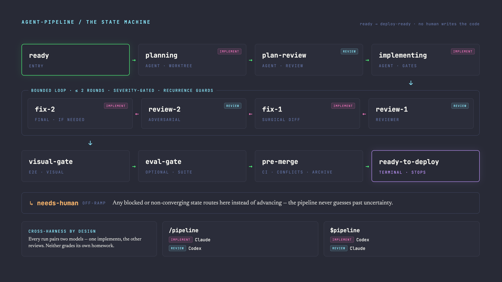

# agent-pipeline

**agent-pipeline** is a label-driven GitHub issue pipeline that advances an issue from backlog to `pipeline:ready-to-deploy` through a 18-stage state machine — backlog → needs-spec → ready → planning → plan-review → pre-code-attestation → implementing → design-gate → review-1 → fix-1 → review-2 → fix-2 → pre-merge → visual-gate → eval-gate → shipcheck-gate → ready-to-deploy, with `needs-human` as the terminal park off-ramp. The ordinary advance path does **not** merge. An operator must authorize a separate merge command.

It ships as a skill for **both Claude Code (`/pipeline`) and Codex (`$pipeline`)** from a single shared TypeScript core. **Both harnesses are required for every run**: one implements, and the other cross-reviews. A runnable repository must declare both roles in `.github/pipeline.yml`. `pipeline init` writes a starter pair from the active profile; after that write, those values are repository policy. The invoking host profile does not select live workers. The pipeline is cross-harness by design — you cannot skip the reviewer install.

## Lifecycle



`ready` is the queue/opt-in entry point. Once a run starts, long-running work is labelled and recorded under the concrete stages that are doing it: `planning`, `plan-review`, and `implementing`. Recoverable stops keep the active `pipeline:*` stage plus `blocked`; exhausted or ambiguous paths park at `needs-human`. The advance path never guesses past uncertainty and never invokes a merge command.

| Band | What happens |
| --- | --- |
| Spec before code | `planning` writes the implementation plan/spec; when enabled, `plan-review` is **independent agent plan review** of that plan (or a labeled same-harness self-review if the reviewer CLI is missing — see [Prerequisites](#prerequisites)) plus an optional **human feedback window** before implementation — not human sign-off. OpenSpec-backed repos reconcile and archive specs during `pre-merge`. |
| Structured review | Reviewers emit findings with severity, confidence, and file/line context. The same review input should lead to the same advance/block decision, not a model coin flip. |
| Bounded convergence | Review/fix rounds are capped by policy and guarded against recurring findings. If the run cannot converge cleanly, it stops with evidence instead of looping indefinitely. |
| Surgical fixes | `fix-1` and `fix-2` are scoped to reviewer findings. No opportunistic refactors, no scope creep, no destructive cleanup. |
| Gated stop | `pre-merge` checks CI, conflicts, mergeability, and spec archive. `visual-gate` can run a repo-defined E2E/visual suite (e.g. Playwright) and captures its artifacts as PR-visible evidence. `eval-gate` can run a repo-defined eval/scoring suite. `shipcheck-gate` lets the reviewer apply an acceptance rubric. |
| Operator-authorized merge | `ready-to-deploy` is the happy-path terminal for the autonomous loop; `needs-human` is the park terminal when review ceilings or similar paths exhaust. A direct operator can use `pipeline merge` or dry-run-first `merge-queue --apply`. |

| Naive AI loop | agent-pipeline lifecycle |
| --- | --- |
| `prompt -> code -> merge` | `plan -> build -> review/fix -> gated stop` |
| Unreviewed, unbounded, opaque | Reviewed, bounded, audited, operator-authorized |

## Contents

- [Prerequisites](#prerequisites)
- [Quickstart](#quickstart)
- [Install](#install)
- [External supervisors](#external-supervisors)
- [Where to go next](#where-to-go-next)
- [Onboarding a new repo](#onboarding-a-new-repo)
- [Development](#development)
- [License](#license)

## Prerequisites

The pipeline is **cross-harness** — each run uses one CLI to implement and the *other* to review. **Both CLIs are required regardless of which host you install.**

- **Node ≥ 24** with **`npm`** (npm ships with Node and installs the core's dependencies — commander, js-yaml, zod). The core runs TypeScript directly via native type-stripping; no build step. If PATH `node` is a still-supported major below 24 (for example Node 22 LTS), the launcher re-execs onto a Node ≥ 24 binary already on the machine (`AGENT_PIPELINE_NODE`, `/usr/bin/node`, or another resolver candidate). `--version` / `-V` work on Node 18–23 without that binary.
- **`git`** and **`gh`** on PATH, with `gh auth status` authenticated against the target repo.
- **Both `claude` and `codex` CLIs** on PATH and **authenticated** — each run uses one to implement and the other to review.
- **Review runs on the *other* harness, invoked directly** (`reviewMode: prompt-harness`): the reviewer CLI is called with the pipeline's own JSON-returning review prompt. **No review plugin is required** — you just need the other harness's CLI installed and authenticated.
- **Same-harness fallback (if the reviewer CLI is missing).** Cross-harness review is the design and the recommended setup — keep both CLIs installed. But if the configured reviewer CLI is *not installed / not spawnable* at review time, the pipeline does not stall: the implementing harness reviews its own work instead, and every such review is **prominently labeled as a same-harness self-review**. A self-reviewed item still advances normally. The advance path never merges. If *neither* harness is spawnable, the item blocks. A reviewer that runs but times out or errors is a genuine failure and still blocks — only a missing CLI triggers the fallback.
- `~/.agent-operating-contract.md` and a per-repo conventions file: `CLAUDE.md` (Claude) or `AGENTS.md` (Codex).
- **Optional:** the [OpenSpec](https://openspec.dev/) CLI (`npm i -g @fission-ai/openspec`) — only needed for repos that opt into the OpenSpec planning flow.
- No API keys — LLM budget comes from your `claude` / `codex` subscriptions.

The installer prints a prerequisite checklist during install (warnings do not block the install).

## Quickstart

**Step 1 — Install**

```bash
# Track the latest default branch:
npx github:accidental-hedge-fund/agent-pipeline install

# Or pin a released tag for a reproducible install (recommended for prod / factory dogfood):
npx -y github:accidental-hedge-fund/agent-pipeline#v1.30.0 install
```

This detects which of `~/.claude` and `~/.codex` exist and installs to each. After installing for Codex, **restart Codex** to pick up the skill. Pin to a released tag (see [GitHub Releases](https://github.com/accidental-hedge-fund/agent-pipeline/releases)) for a reproducible install.

### Factory two-track engine pinning (#762)

Factory production and dogfood runs should execute the **last FRG-passed release** named by
`.agent-pipeline/production-engine-pin.json` (install from that tag), not an unpinned working-tree
candidate. FRG Layer B / eval soaks use the **candidate** track until promote:

```bash
pipeline factory-pin show
pipeline factory-pin promote --for X.Y.Z   # FRG pass:true + real run_id + evidence path
npx -y github:accidental-hedge-fund/agent-pipeline#vX.Y.Z install
pipeline doctor                            # install:engine-track; install:production-pin-path fails a split env pin
pipeline factory-pin rollback              # repoint to previous + reinstall
```

See [docs/factory-reliability-gate-runbook.md](docs/factory-reliability-gate-runbook.md#two-track-engine-pinning-762).

**Step 2 — Label an issue and run**

```bash
# Create the pipeline:ready label if it doesn't exist yet
gh label create "pipeline:ready" --color 0075ca --description "Start the pipeline" 2>/dev/null || true

# Label any open issue to opt it in
gh issue edit N --add-label "pipeline:ready"
```

Then invoke from Claude Code:

```text
/pipeline N
```

Or from Codex (after restarting it):

```text
$pipeline N
```

The pipeline advances the issue through planning, implementation, cross-harness review, fix rounds, and pre-merge checks — without further manual input — and stops at `pipeline:ready-to-deploy` for an operator-authorized merge.

## External supervisors

An external supervisor (chat bot, host agent, or shell automation) may compose the
existing Pipeline CLI: `pipeline single`, `pipeline train`, `pipeline loop`,
`pipeline merge`, `pipeline merge-queue --apply`, `pipeline ship --milestone`,
`pipeline release`, and related read-only commands. This repository does **not** ship a Hermes/Buzz/Slack factory
control plane, grant schema, or second durable scheduler.

Ordinary `pipeline advance`, `pipeline single`, and `pipeline loop` still stop at
`pipeline:ready-to-deploy` and never merge. Multi-issue integrate trains use
opt-in `pipeline train --merge`. Repository content in `.github/pipeline.yml`
cannot authorize merges and cannot set `auto_merge`.

**Bootstrap for any platform:** [supervisor contract](docs/supervisor.md) and
thin examples under [`examples/supervisor/`](examples/supervisor/) (shell, Hermes,
OpenClaw, Slack notes). Adapters only map intent → CLI.

For the current Grok profile, planning, implementation, and fixes use only
`grok-4.6`, with no Grok model fallback. Codex performs independent review. See
[the factory simplification plan](docs/factory-simplification-plan.md) for product
direction.

## Install

> Public repo under the `accidental-hedge-fund` org — no special access needed.

### Recommended: one command, both hosts

```bash
# Detects ~/.claude and ~/.codex; installs to each present host
npx github:accidental-hedge-fund/agent-pipeline install

# Or a specific host:
npx github:accidental-hedge-fund/agent-pipeline install --host claude
npx github:accidental-hedge-fund/agent-pipeline install --host codex
npx github:accidental-hedge-fund/agent-pipeline install --host opencode
```

For a reproducible, non-interactive install — pin a released tag and auto-accept optional-dependency prompts with `--yes-deps`:

```bash
npx -y github:accidental-hedge-fund/agent-pipeline#v1.29.1 install --host claude --yes-deps
```

The bare commands track the **latest** default branch; add `#<tag>` to pin a release. The pipeline is **cross-harness** regardless of which host you install — `--host claude` only controls where the skill lands; the *other* harness's CLI is still required for review.

**Outer-host lifecycle (#784):** installable hosts are declared by co-located
`hosts/<id>/outer-host.manifest.json` files (install mode, skill/command surface,
handoff/follow/reattach/notify/cleanup/summary capabilities). The installer and
discovery enumerate those manifests rather than a closed host-name table. Shared
orchestration consumes declared capabilities; portable baseline is stdout JSON +
`events.jsonl`. Set `PIPELINE_OUTER_HOST=<id>` so run evidence records outer-host
identity separately from implementer/reviewer adapter treatment. See
`core/scripts/outer-hosts/` and the OpenSpec change `outer-host-lifecycle-contract`.

Or clone and run directly:

```bash
gh repo clone accidental-hedge-fund/agent-pipeline
node agent-pipeline/scripts/install.mjs install        # --host claude|codex|grok|opencode|all  (default: all)
```

The installer copies the shared core and the right host overlay into `~/.claude/skills/pipeline`, `~/.codex/skills/pipeline`, and/or `~/.config/opencode/skills/pipeline`, writes a launcher shim, and pre-installs the core's dependencies. It honors `CLAUDE_CONFIG_DIR`, `CODEX_HOME`, and `OPENCODE_CONFIG_DIR` (Claude `/pipeline:*` command files and the OpenCode `/pipeline` command embed the resolved skill path under that config dir). `OPENCODE_CONFIG` (single config **file**) is not used as an install base. If a **personal** skill already exists at the host's skills path without the installer's managed marker, install offers relocation (or auto-relocates in non-TTY) for **Claude, Codex, and OpenCode** tree hosts so the personal tree is not silently overwritten. **Restart Codex** after a Codex install; Claude picks the skill up live. OpenCode may need a restart/reload if commands do not appear live.

### Optional dependency prompts

After the core install, the installer may prompt for optional tools (OpenSpec CLI, last30days skill). Declining still completes the core install.

```bash
npx github:accidental-hedge-fund/agent-pipeline install --yes-deps
PIPELINE_INSTALL_DEPS=1 npx github:accidental-hedge-fund/agent-pipeline install  # same via env var
```

### Grok (optional)

```bash
npx github:accidental-hedge-fund/agent-pipeline install --host grok
# or from a clone:
node scripts/install.mjs install --host grok
```

### OpenCode

```bash
npx github:accidental-hedge-fund/agent-pipeline install --host opencode
# or from a clone:
node scripts/install.mjs install --host opencode
```

Default install locations (override the config base with `OPENCODE_CONFIG_DIR`):

| Surface | Default path |
| --- | --- |
| Skill tree | `~/.config/opencode/skills/pipeline` |
| Native `/pipeline` command | `~/.config/opencode/commands/pipeline.md` |

The OpenCode `/pipeline` command is an **OpenCode markdown command** (LLM-mediated prompt template — OpenCode does not support pure no-LLM side-effect slash commands). The installer writes a template that **shell-injects** an argv-safe bridge so the installed launcher runs and its stdout is injected into the prompt before the agent turn. For `--version` / `-V`, the inject output equals `node ~/.config/opencode/skills/pipeline/scripts/pipeline.mjs --version` (from `core/package.json` at the install root), and the template instructs the agent to report only that version string without dumping generic skill instructional text.

### Uninstall

```bash
npx github:accidental-hedge-fund/agent-pipeline uninstall --host all   # or claude | codex | opencode | grok
# or from a clone:
node scripts/install.mjs uninstall --host all
```

Uninstall removes the host skill tree. For Claude it also removes installer-written `pipeline:*.md` command files under the resolved Claude config `commands/` directory (same base as install / `CLAUDE_CONFIG_DIR`); other command files are left alone. For OpenCode it removes the managed skill tree and installer-owned `commands/pipeline.md` only (sibling OpenCode commands are left alone).

## Benchmark & Reliability Suite

| Doc | What it covers |
| --- | --- |
| **[docs/cli.md](docs/cli.md)** | Full CLI command reference (generated from the command registry) |
| **[docs/config.md](docs/config.md)** | `.github/pipeline.yml` config key reference (generated from the Zod schema) |
| **[docs/concepts.md](docs/concepts.md)** | Advanced/optional topics: gates, OpenSpec, review policy, desktop integration, troubleshooting |
| **[CHANGELOG.md](CHANGELOG.md)** | Per-version release history (generated from git tags) |
| **[ROADMAP.md](ROADMAP.md)** | Human-readable forward plan (GitHub milestones are release-plan authority) |

**Common commands** (see [docs/cli.md](docs/cli.md) for the full inventory):

```text
/pipeline N                 # advance issue N (Claude)
$pipeline N                 # advance issue N (Codex)
/pipeline:status N          # stage, blocker, PR, last review
/pipeline:doctor            # deterministic preflight (opt-in --harness-smoke)
/pipeline:init              # labels + .github/pipeline.yml scaffold
/pipeline decompose --epic N            # preview epic → child graph (no writes)
/pipeline decompose --epic N --apply    # create children + ROADMAP PR (never merges)
```

`pipeline decompose` breaks one epic issue into small dependency-linked children
and a human-reviewable ROADMAP PR. It is **not** `intake` (1 description → 1 issue),
**not** `roadmap` (score/order existing backlog), and **not** `loop` (execute a
selector). Dry-run is the default. With `--apply`, children get `pipeline:ready`
when decision-complete or `pipeline:backlog` when open questions remain; the
parent is labeled `pipeline:epic` and is excluded from default milestone/label
loop selectors. Then run `pipeline loop --milestone <lane>` on the children.

## Onboarding a new repo

```bash
# From the target repo:
/pipeline:init              # or: pipeline init
# Commit .github/pipeline.yml (edit as needed), then:
gh issue edit N --add-label "pipeline:ready"
/pipeline N
```

`init` ensures pipeline labels, scaffolds `.github/pipeline.yml`, and gitignores local-only `.agent-pipeline/` paths (including `.agent-pipeline/runs/`, `.agent-pipeline/roadmap/`, `.agent-pipeline/history/`, and `.agent-pipeline/frg/`). For configuration detail, see [docs/config.md](docs/config.md). For optional gates, OpenSpec, and conventions, see [docs/concepts.md](docs/concepts.md).

## Development

```bash
npm run setup-hooks               # one-time per clone: auto-regenerate plugin/ on core/ commits
cd core && npm ci && npm test     # node --test
node scripts/build.mjs            # regenerate plugin/ after editing core or the Claude overlay
node scripts/build.mjs --check    # CI gate: fail if committed plugin/ is stale
node scripts/generate-docs.mjs    # regenerate docs/cli.md, docs/config.md, CHANGELOG.md, SKILL tables
node scripts/generate-docs.mjs --check
npm run docs:generate             # same as generate-docs write mode
npm run docs:check                # same as generate-docs --check
npm run ci                        # full CI gate (tests + mirror + install-smoke + openspec + docs + scripts)
```

After changing anything under `core/` or `hosts/claude/SKILL.md`, re-run `build.mjs` and commit the regenerated `plugin/` (CI enforces this). After changing the command registry, config schema, or docs generator, re-run `generate-docs.mjs` and commit generated docs (CI enforces this via `ci:docs` once the generator is present).

`npm run ci` always includes a **conditional** docs freshness step (`ci:docs`): it is a no-op when the docs generator is absent, and runs check-mode when `scripts/generate-docs.mjs` is present — so a stale generated artifact fails the same local command the pipeline test-gate runs.

## License

MIT License

Copyright (c) 2026 AHF

Permission is hereby granted, free of charge, to any person obtaining a copy
of this software and associated documentation files (the "Software"), to deal
in the Software without restriction, including without limitation the rights
to use, copy, modify, merge, publish, distribute, sublicense, and/or sell
copies of the Software, and to permit persons to whom the Software is
furnished to do so, subject to the following conditions:

The above copyright notice and this permission notice shall be included in all
copies or substantial portions of the Software.

THE SOFTWARE IS PROVIDED "AS IS", WITHOUT WARRANTY OF ANY KIND, EXPRESS OR
IMPLIED, INCLUDING BUT NOT LIMITED TO THE WARRANTIES OF MERCHANTABILITY,
FITNESS FOR A PARTICULAR PURPOSE AND NONINFRINGEMENT. IN NO EVENT SHALL THE
AUTHORS OR COPYRIGHT HOLDERS BE LIABLE FOR ANY CLAIM, DAMAGES OR OTHER
LIABILITY, WHETHER IN AN ACTION OF CONTRACT, TORT OR OTHERWISE, ARISING FROM,
OUT OF OR IN CONNECTION WITH THE SOFTWARE OR THE USE OR OTHER DEALINGS IN THE
SOFTWARE.
